# Enterprise Document Intelligence

### AI-powered document processing, knowledge retrieval, and workflow automation

**A production-oriented enterprise AI application powered by a reusable AI Workflow Orchestration Platform.**

<p align="center">
  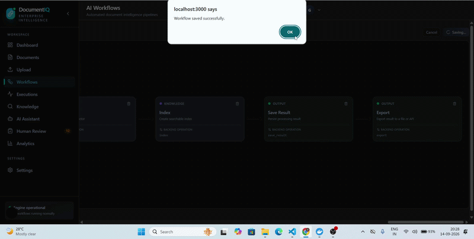
</p>

<p align="center">
  <strong>Document → Process → Extract → Validate → Retrieve → Orchestrate → Review → Result</strong>
</p>

---

## 🚀 Live Application

**Live Demo:** [https://enterprize-ai.vercel.app/](https://enterprize-ai.vercel.app/?utm_source=chatgpt.com)

<p align="center">
  <a href="https://enterprize-ai.vercel.app/">
    <strong>🌐 Open Enterprise Document Intelligence</strong>
  </a>
</p>


## Overview

**Enterprise Document Intelligence** is an AI-powered platform for processing, understanding, searching, and analyzing enterprise documents.

The system combines **document intelligence, knowledge retrieval, AI-assisted analysis, and workflow orchestration** into a unified platform. Documents move through configurable processing pipelines that classify, extract, validate, index, and transform unstructured content into structured and actionable information.

At the foundation is a reusable **AI Workflow Orchestration Platform** that provides the execution infrastructure for document and AI workflows. Application-specific capabilities such as invoice processing, contract analysis, and resume intelligence are built on top of this reusable engine.

### Platform Architecture

<p align="center">
  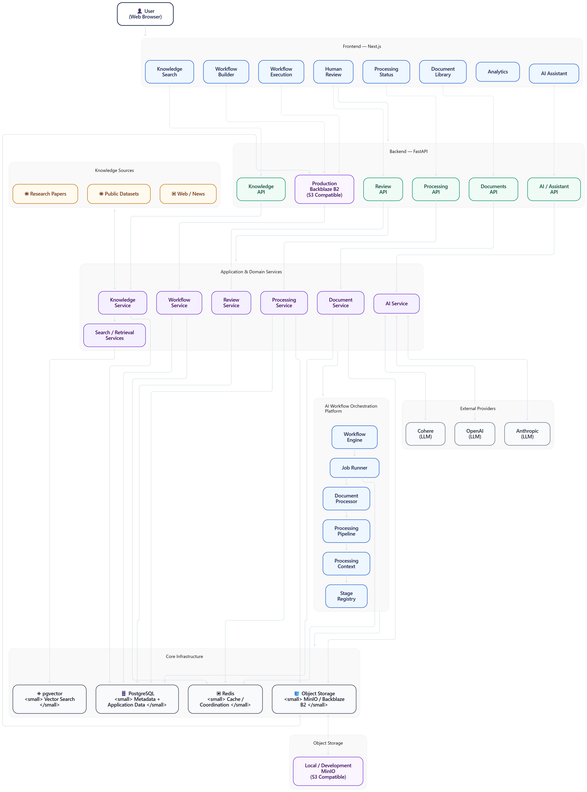
</p>

The platform separates the **application layer** from the underlying **AI workflow and processing infrastructure**, allowing document intelligence workflows to share the same execution, storage, retrieval, and orchestration capabilities.

### End-to-End Flow

<p align="center">
  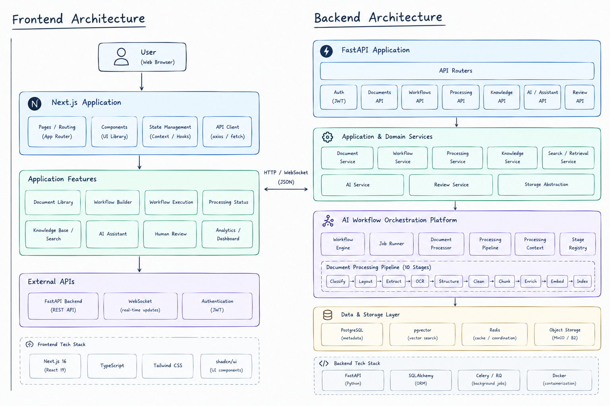
</p>

The overall workflow follows:

**Document Ingestion → Processing → Extraction → Validation → Knowledge Base → AI Workflow → Human Review → Final Result**

---

## Problem

Enterprise documents contain valuable information, but processing them reliably often requires multiple disconnected systems.

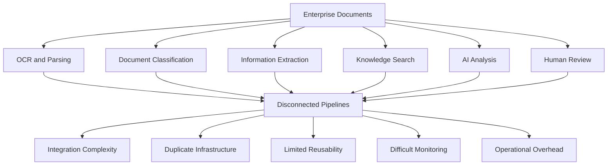

This fragmentation makes it difficult to build consistent, reusable, and observable document workflows across different enterprise use cases.

---

## Solution

Enterprise Document Intelligence brings document processing, knowledge retrieval, AI reasoning, and workflow automation together through a reusable **AI Workflow Orchestration Platform**.

Instead of building separate pipelines for every document use case, application workflows can compose reusable processing and AI capabilities from a shared execution engine.

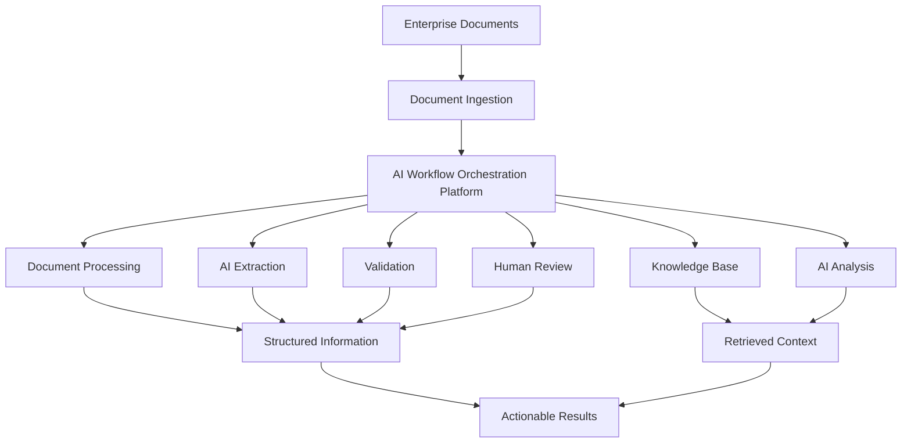

### Reusable Platform Model

```text
Enterprise Applications
        │
        ├── Invoice Processing
        ├── Contract Analysis
        └── Resume Intelligence
        │
        ▼
AI Workflow Orchestration Platform
        │
        ├── Processing
        ├── Extraction
        ├── Validation
        ├── Retrieval / RAG
        ├── AI Reasoning
        ├── Conditional Logic
        ├── Background Jobs
        └── Execution Tracking
        │
        ▼
Infrastructure
        ├── PostgreSQL
        ├── Redis
        └── Object Storage
```

This architecture makes the platform **modular, reusable, and extensible**, allowing new enterprise workflows to be developed without rebuilding the underlying AI and document-processing infrastructure.

---

## Key Capabilities

```mermaid
flowchart TD
    A[Enterprise Document Intelligence]

    A --> B[Document Intelligence]
    A --> C[Knowledge Intelligence]
    A --> D[AI Workflow Orchestration]
    A --> E[Enterprise Platform]

    B --> B1[Ingestion]
    B --> B2[OCR and Parsing]
    B --> B3[Classification]
    B --> B4[Information Extraction]
    B --> B5[Validation]
    B --> B6[Confidence Scoring]

    C --> C1[Document Chunking]
    C --> C2[Embeddings]
    C --> C3[Semantic Search]
    C --> C4[Keyword Search]
    C --> C5[Hybrid Retrieval]
    C --> C6[RAG]

    D --> D1[Reusable Workflows]
    D --> D2[Composable Nodes]
    D --> D3[Conditional Execution]
    D --> D4[Background Jobs]
    D --> D5[Execution Tracking]
    D --> D6[Human Review]

    E --> E1[REST API]
    E --> E2[Authentication]
    E --> E3[Multi Tenancy]
    E --> E4[RBAC]
    E --> E5[Audit Logging]
    E --> E6[Persistent Storage]
```

### Core Capabilities

| Area                       | Capabilities                                                                                                   |
| -------------------------- | -------------------------------------------------------------------------------------------------------------- |
| **Document Intelligence**  | Ingestion, OCR, parsing, classification, extraction, validation, confidence scoring                            |
| **Knowledge Intelligence** | Chunking, embeddings, semantic search, keyword search, hybrid retrieval, RAG                                   |
| **Workflow Orchestration** | Reusable workflows, composable nodes, conditional execution, background jobs, execution tracking, human review |
| **Enterprise Platform**    | REST APIs, authentication, multi-tenancy, RBAC, audit logging, persistent storage                              |

---

## End-to-End Document Processing

Documents move through a configurable processing pipeline that transforms unstructured files into validated, searchable, and actionable information.

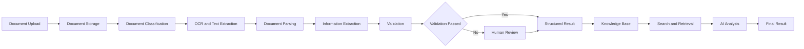

### Processing Stages

| Stage              | Description                                                       |
| ------------------ | ----------------------------------------------------------------- |
| **Upload**         | Accept and register enterprise documents                          |
| **Storage**        | Persist original files and processing artifacts                   |
| **Classification** | Identify the document type and processing path                    |
| **OCR & Parsing**  | Convert document content into machine-readable text and structure |
| **Extraction**     | Extract fields, entities, tables, and domain-specific information |
| **Validation**     | Check extracted information and assign confidence signals         |
| **Human Review**   | Route uncertain or failed results for manual verification         |
| **Knowledge Base** | Chunk and index processed content for future retrieval            |
| **AI Analysis**    | Use retrieved context for downstream AI workflows                 |
| **Final Result**   | Produce structured, validated, and actionable output              |

<p align="center">
  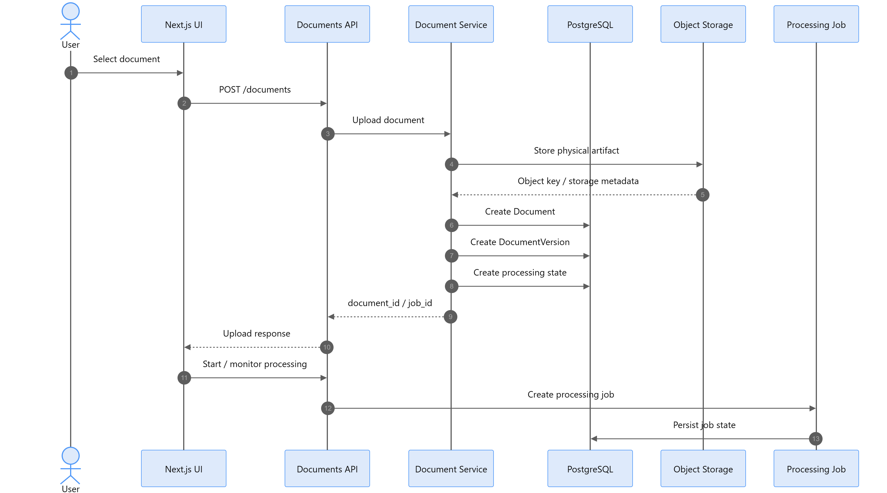
</p>

---

## AI Workflow Orchestration

The **AI Workflow Orchestration Platform** provides the reusable execution layer behind Enterprise Document Intelligence.

Instead of implementing each document use case as an isolated pipeline, workflows are composed from reusable processing, AI, retrieval, validation, and human-review components.

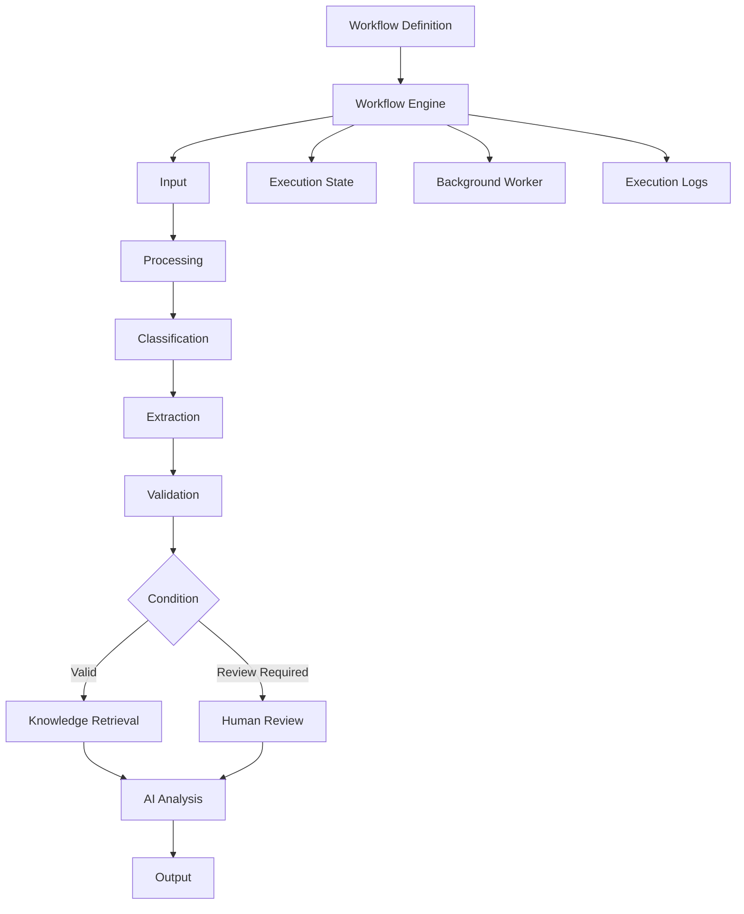

### Reusable Workflow Model

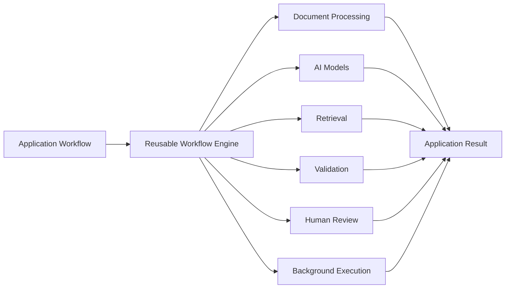

### Example Workflow

```text
Document
   │
   ▼
Input
   │
   ▼
Classification
   │
   ▼
Extraction
   │
   ▼
Validation
   │
   ├── Valid ───────────────┐
   │                        ▼
   └── Review Required → Human Review
                            │
                            ▼
                     Knowledge / Retrieval
                            │
                            ▼
                       AI Analysis
                            │
                            ▼
                      Structured Output
```

### Why the Engine Matters

The orchestration layer separates **workflow execution infrastructure** from **business-specific document applications**.

This allows the same execution primitives to support workflows such as:

* Invoice processing
* Contract analysis
* Resume intelligence
* Knowledge retrieval
* AI-assisted document analysis

New workflows can therefore be assembled from existing capabilities rather than rebuilding the entire processing pipeline for each application.

<p align="center">
  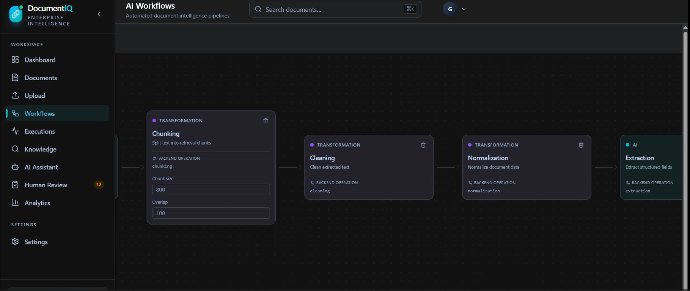
</p>

---

## Knowledge Base & RAG

The platform converts processed documents into a searchable knowledge layer that supports semantic retrieval and AI-assisted analysis.

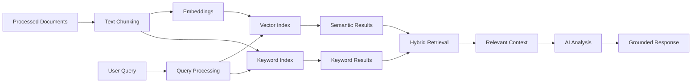

### Retrieval Pipeline

**Document → Chunking → Embeddings → Indexing → Query → Hybrid Retrieval → Context → AI Analysis**

<p align="center">
  
</p>

### Knowledge Layer

The knowledge base provides the retrieval foundation for document-aware AI workflows:

* Document chunking and preprocessing
* Embedding generation
* Vector-based semantic retrieval
* Keyword-based retrieval
* Hybrid retrieval
* Metadata-aware filtering
* Context construction for downstream AI processing

---

## Application Workflows

Enterprise Document Intelligence provides reusable AI workflows for common enterprise document use cases.

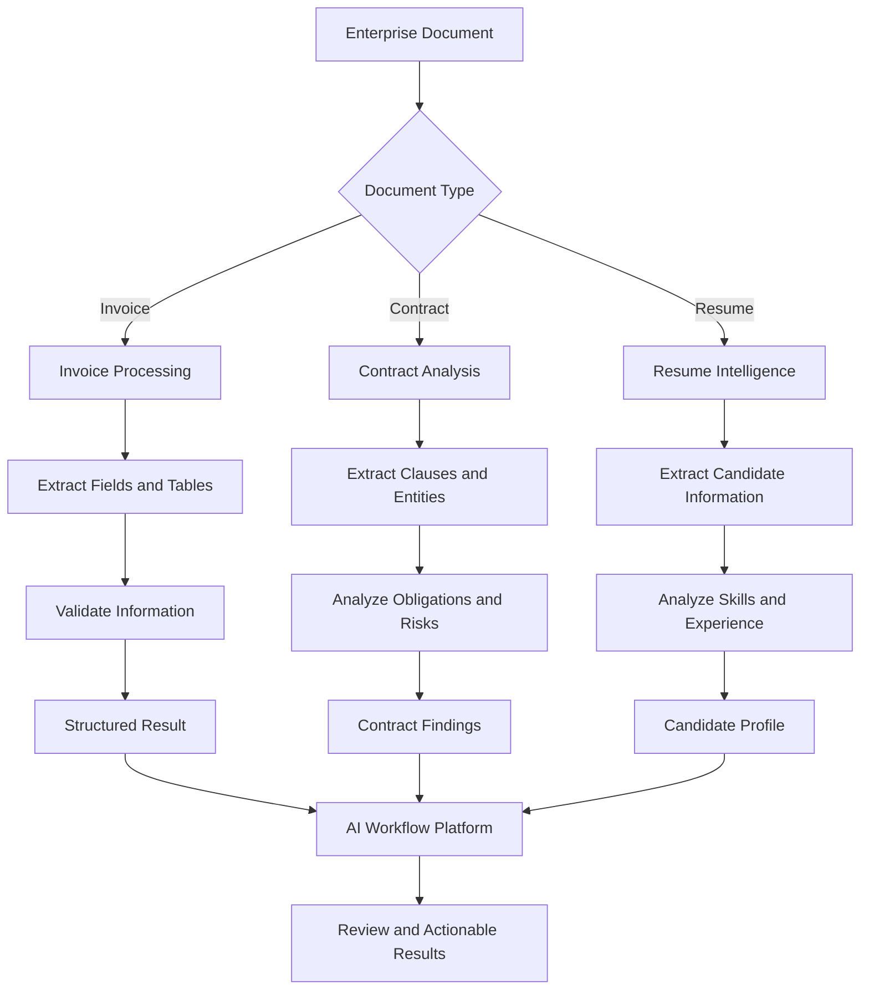

### Invoice Processing

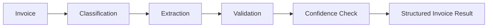

Extracts and validates relevant invoice information such as fields, entities, and tables before producing structured results.

### Contract Analysis


Processes contracts to identify relevant clauses, entities, obligations, and AI-generated findings.

### Resume Intelligence


Transforms resumes into structured candidate information containing relevant skills, experience, and extracted attributes.

### Shared Execution Layer

All three workflows use the same underlying platform capabilities:

**Document Processing → Extraction → Validation → Retrieval → AI Analysis → Workflow Execution → Structured Results**

---

## System Architecture

Enterprise Document Intelligence follows a layered architecture that separates the **user-facing application**, **API and business services**, **AI processing and orchestration**, and **infrastructure services**.

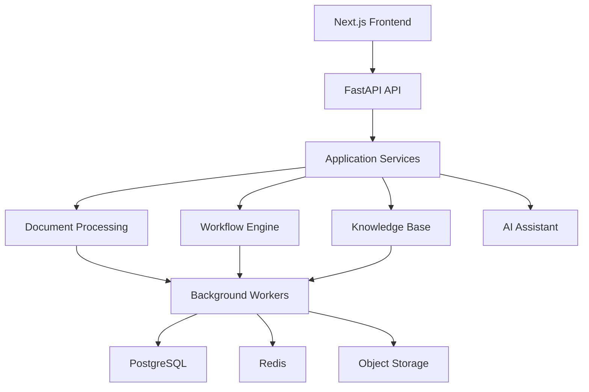

### Architecture Layers

| Layer                     | Responsibility                                                                                           |
| ------------------------- | -------------------------------------------------------------------------------------------------------- |
| **Frontend**              | Document management, workflow interfaces, AI interaction, results, and analytics                         |
| **API Layer**             | REST endpoints, authentication, request validation, and API coordination                                 |
| **Application Services**  | Document processing, extraction, validation, knowledge, assistant, analytics, and audit services         |
| **AI Workflow Engine**    | Reusable workflow definitions, execution, orchestration, and state management                            |
| **AI & Retrieval Layer**  | Embeddings, semantic retrieval, keyword retrieval, hybrid search, and AI analysis                        |
| **Background Workers**    | Asynchronous document and workflow processing                                                            |
| **Data Layer**            | PostgreSQL for structured data, Redis for caching and job coordination, and object storage for documents |
| **Observability & Audit** | Execution tracking, audit records, processing state, and operational metadata                            |

<p align="center">
  
</p>

### Application-to-Platform Relationship

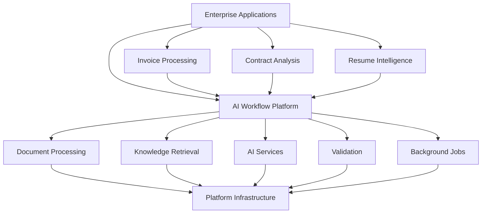

The architecture is designed so that **enterprise applications remain decoupled from the underlying AI execution infrastructure**. The same orchestration and processing capabilities can therefore be reused across multiple document-driven applications.

---

## Project Structure

```text
enterprise-ai/
│
├── backend/
│   ├── app/
│   │   ├── api/                 # REST API routes
│   │   ├── assistant/           # AI assistant orchestration
│   │   ├── analytics/           # Usage and system analytics
│   │   ├── audit/               # Audit logging
│   │   ├── classifiers/         # Document classification
│   │   ├── comparison/          # Document and result comparison
│   │   ├── confidence/          # Confidence scoring
│   │   ├── extractors/          # Structured information extraction
│   │   ├── knowledge/           # Knowledge base and retrieval
│   │   ├── ocr/                 # OCR and document text extraction
│   │   ├── processing/          # Document processing pipelines
│   │   ├── storage/             # Document and artifact storage
│   │   ├── validators/          # Validation and verification
│   │   ├── workers/             # Background job execution
│   │   └── workflows/           # AI workflow orchestration engine
│   │
│   ├── alembic/                 # Database migrations
│   ├── scripts/                 # Operational and utility scripts
│   ├── tests/                   # Backend test suite
│   ├── Dockerfile
│   ├── requirements.txt
│   └── .env.example
│
├── frontend/
│   ├── app/                     # Next.js application routes
│   ├── components/              # Reusable UI components
│   ├── context/                 # Application state and providers
│   ├── lib/                     # API clients and frontend utilities
│   ├── public/                  # Static assets
│   └── types/                   # TypeScript types
│
├── docs/
│   ├── architecture.md
│   ├── document-processing.md
│   ├── workflow-engine.md
│   ├── ai-knowledge-base.md
│   ├── security-multitenancy.md
│   ├── deployment.md
│   ├── img/                     # Architecture and system diagrams
│   └── vid/                     # Demo videos
│
├── docker-compose.yml
└── README.md
```

---

## Technology Stack

| Layer                     | Technologies                             |
| ------------------------- | ---------------------------------------- |
| **Frontend**              | Next.js, React, TypeScript, Tailwind CSS |
| **Backend**               | FastAPI, Python                          |
| **Database**              | PostgreSQL                               |
| **Cache & Jobs**          | Redis                                    |
| **Document Storage**      | Object Storage                           |
| **AI / LLM**              | LLM provider integrations                |
| **Embeddings**            | BAAI BGE-small                           |
| **Retrieval**             | Semantic, keyword, and hybrid retrieval  |
| **Workflow Engine**       | Custom AI workflow orchestration         |
| **Background Processing** | Asynchronous workers                     |
| **Database Migrations**   | Alembic                                  |
| **API**                   | REST / JSON                              |
| **Deployment**            | Docker, Docker Compose                   |
| **Testing**               | Pytest                                   |

---

## Quick Start

### Prerequisites

Make sure you have:

* Docker
* Docker Compose
* Git

### 1. Clone the Repository

```bash
git clone https://github.com/garimakumari44/enterprize_ai.git
cd enterprize_ai
```

### 2. Configure Environment Variables

Create the backend environment file:

```bash
cd backend
cp .env.example .env
```

Configure the required database, Redis, storage, and AI provider settings in `.env`.

Return to the project root:

```bash
cd ..
```

### 3. Start the Platform

```bash
docker compose up --build
```

This starts the platform services defined in Docker Compose.

### 4. Access the Application

Open the frontend:

```text
http://localhost:3000
```

FastAPI documentation:

```text
http://localhost:<BACKEND_PORT>/docs
```

### 5. Stop the Platform

```bash
docker compose down
```

To remove associated volumes as well:

```bash
docker compose down -v
```

### Local Development

For development without Docker, install the backend and frontend dependencies separately, configure the required environment variables, and start the FastAPI and Next.js applications independently.

For detailed deployment and environment configuration, see [`docs/deployment.md`](docs/deployment.md).

---

## Demo

### Full Platform Walkthrough

A complete 3-minute walkthrough of **Enterprise Document Intelligence**, covering document ingestion, AI processing, knowledge retrieval, workflow orchestration, and enterprise document workflows.

<p align="center">
  <a href="https://youtu.be/97PX_ic7CKo">
    
  </a>
</p>

<p align="center">
  <strong>▶ Watch the full 3-minute demo on YouTube</strong>
</p>

The original demo video is also included in the repository:

```text
docs/vid/enterprise.mp4
```

---

## API

The platform exposes a RESTful API through **FastAPI**, providing programmatic access to document processing, AI workflows, knowledge retrieval, authentication, analytics, and enterprise operations.

### Core API Areas

| Area               | Purpose                                           |
| ------------------ | ------------------------------------------------- |
| **Authentication** | User authentication, sessions, and access control |
| **Documents**      | Upload, manage, process, and retrieve documents   |
| **Processing**     | Start and monitor document-processing jobs        |
| **Workflows**      | Create, execute, and monitor AI workflows         |
| **Knowledge Base** | Index documents and perform knowledge retrieval   |
| **AI Assistant**   | Interact with document-aware AI capabilities      |
| **Analytics**      | Usage and processing metrics                      |
| **Audit**          | Track platform and user activity                  |

### API Architecture

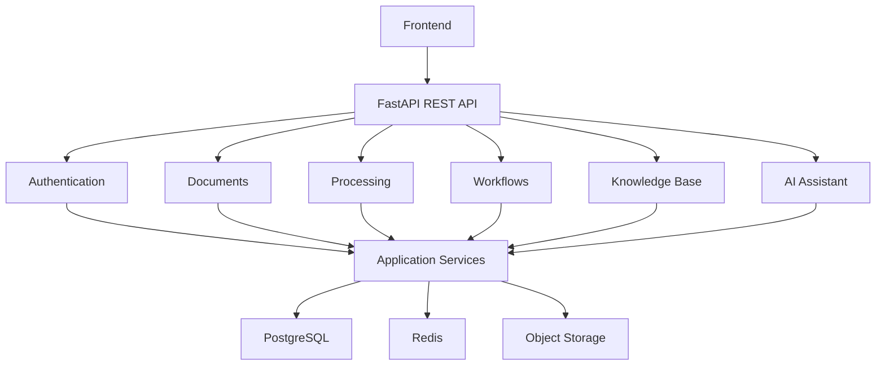

### Interactive API Documentation

When running locally, FastAPI provides interactive API documentation:

```text
http://localhost:<BACKEND_PORT>/docs
```

OpenAPI schema:

```text
http://localhost:<BACKEND_PORT>/openapi.json
```

The API is designed as an **API-first layer**, allowing the frontend and external clients to interact with the same document intelligence and workflow services.

---

## Documentation

Detailed technical documentation is available in the `docs/` directory.

| Documentation                                               | Description                                                |
| ----------------------------------------------------------- | ---------------------------------------------------------- |
| [`architecture.md`](docs/architecture.md)                   | System architecture and platform components                |
| [`document-processing.md`](docs/document-processing.md)     | Document ingestion and processing pipeline                 |
| [`workflow-engine.md`](docs/workflow-engine.md)             | AI workflow orchestration and execution                    |
| [`ai-knowledge-base.md`](docs/ai-knowledge-base.md)         | Knowledge base, retrieval, and RAG                         |
| [`security-multitenancy.md`](docs/security-multitenancy.md) | Security, authentication, authorization, and multi-tenancy |
| [`deployment.md`](docs/deployment.md)                       | Local and containerized deployment                         |

---

## Engineering Principles

* **Reusable AI infrastructure** — shared capabilities instead of isolated pipelines
* **Modular architecture** — clear separation between applications, services, and infrastructure
* **API-first design** — backend capabilities exposed through structured APIs
* **Asynchronous processing** — long-running document and workflow operations handled through background execution
* **Retrieval-aware AI** — AI analysis can operate on retrieved document context
* **Validation and human review** — uncertain processing results can be routed for verification
* **Traceable execution** — workflows and processing stages maintain execution state and operational metadata
* **Containerized deployment** — reproducible development and deployment environments

---

## Roadmap

Potential future improvements include:

* Expanded document formats and processing pipelines
* More workflow node types
* Advanced evaluation and AI quality metrics
* Expanded observability and tracing
* Additional enterprise integrations
* More configurable human-in-the-loop workflows
* Advanced workflow versioning and management

---

## License

This project is provided for educational, research, and portfolio purposes.
