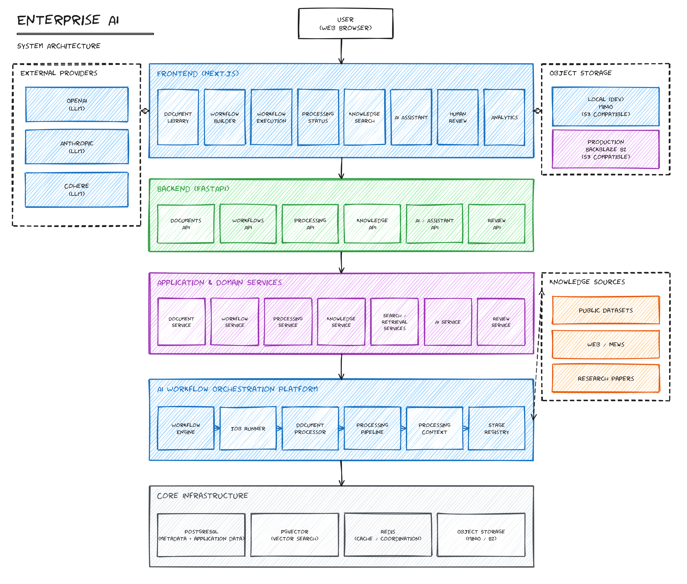
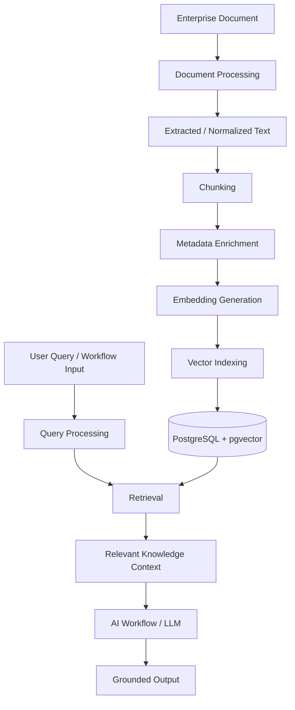
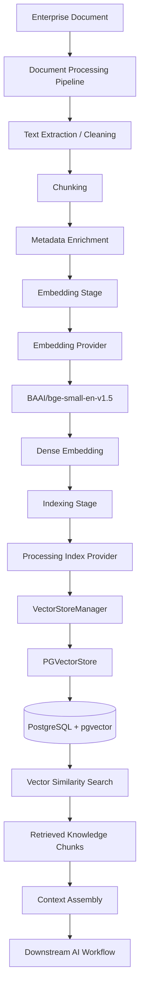
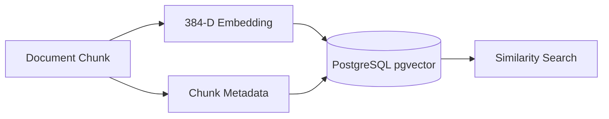
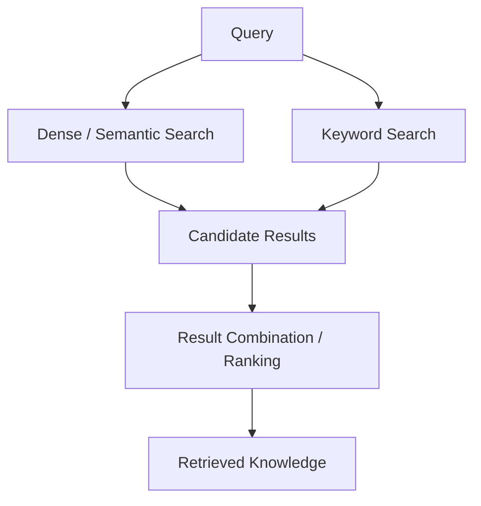
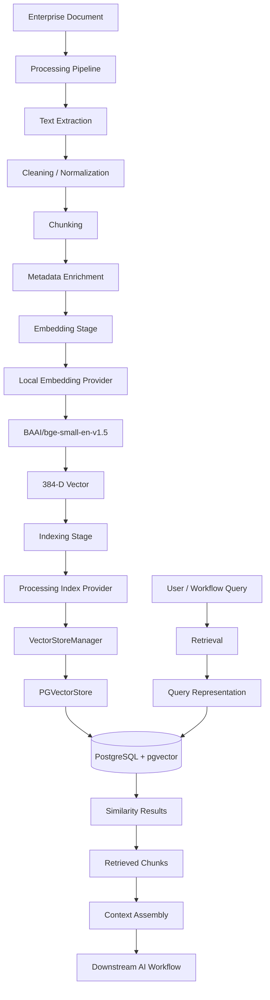

AI Knowledge Base
> **Enterprise Document Intelligence & AI Workflow Orchestration Platform**
>
> Document ingestion · Chunking · Embeddings · PostgreSQL/pgvector · Semantic Retrieval · AI Knowledge
---
Overview
The AI Knowledge Base is the retrieval-oriented subsystem of the Enterprise AI platform.
Its responsibility is to transform processed enterprise documents into searchable knowledge that downstream AI capabilities can retrieve when performing document-centric tasks.
The knowledge lifecycle begins after a document enters the document-processing pipeline:


The platform therefore separates document intelligence from knowledge retrieval.
Document processing is responsible for understanding and normalizing uploaded files. The Knowledge Base takes the resulting textual units, enriches them with metadata, generates embeddings, and makes them searchable.
The current concrete implementation uses:
PostgreSQL as the persistent database
PostgreSQL `pgvector` for vector storage and similarity search
SQLAlchemy for database access
a local Hugging Face embedding provider
`BAAI/bge-small-en-v1.5` as the configured embedding model
CPU inference
batch embedding generation
document/chunk metadata associated with stored vectors
The canonical vector collection used by the processing pipeline is:
```text
document_chunk_vectors
```
The document chunk storage is:
```text
document_chunks
```
---
Knowledge Base Architecture
The current architecture connects the document-processing pipeline to PostgreSQL/pgvector through the indexing layer.

The important architectural boundary is the vector-store abstraction.
The processing pipeline does not directly couple every stage to PostgreSQL-specific implementation details. Indexing goes through the processing/indexing layer and then the Knowledge Base vector-store abstraction.
Relevant repository areas include:
```text
backend/app/
├── knowledge/
│   └── vector_store/
│       ├── base.py
│       ├── pgvector.py
│       └── vector_manager.py
│
├── processing/
│   ├── stages/
│   │   ├── classification.py
│   │   ├── layout_analysis.py
│   │   ├── text_extraction.py
│   │   ├── ocr.py
│   │   ├── structure_detection.py
│   │   ├── cleaning.py
│   │   ├── chunking.py
│   │   ├── metadata_enrichment.py
│   │   ├── embedding.py
│   │   └── indexing.py
│   │
│   ├── embeddings/
│   │   └── factory
│   │
│   ├── indexing/
│   │   ├── indexer.py
│   │   └── provider.py
│   │
│   └── pipeline/
│       └── pipeline.py
│
├── api/
│   └── v1/
│
├── db/
│   └── models/
│
├── services/
│
└── tasks/
    └── knowledge/
```
The repository also contains retrieval abstractions under `backend/app/knowledge`, including semantic, keyword, hybrid, reranking, and vector-search modules. Their presence should be distinguished from the concrete processing/indexing path rather than assuming every abstraction is active in every request.
---
Knowledge Lifecycle
The Knowledge Base lifecycle is:
```text
Document
   │
   ▼
Document Processing
   │
   ▼
Extracted / Normalized Text
   │
   ▼
Chunks
   │
   ▼
Metadata Enrichment
   │
   ▼
Embedding Generation
   │
   ▼
Vector Indexing
   │
   ▼
PostgreSQL / pgvector
   │
   ▼
Query
   │
   ▼
Retrieval
   │
   ▼
Relevant Chunks
   │
   ▼
Context Assembly
   │
   ▼
AI Workflow
```
Each stage has a distinct responsibility.
Stage	Responsibility
Document ingestion	Accept and represent the uploaded document
Text extraction	Produce textual content from the document
Cleaning / normalization	Prepare extracted text for downstream processing
Chunking	Divide document text into retrieval-sized units
Metadata enrichment	Attach document/chunk-level metadata
Embedding	Convert chunks into dense vectors
Indexing	Persist searchable vector representations
Retrieval	Find relevant stored knowledge
Context assembly	Convert retrieved knowledge into workflow-consumable context
The document-processing pipeline currently registers ten processing stages:
Classification
Layout Analysis
Text Extraction
OCR
Structure Detection
Cleaning
Chunking
Metadata Enrichment
Embedding
Indexing
The Knowledge Base becomes especially relevant at the chunking, metadata enrichment, embedding, and indexing boundaries.
---
Document-to-Knowledge Transformation
1. Document
The process starts with an enterprise document uploaded to the platform.
The document remains the authoritative source. The Knowledge Base does not replace the original document; it creates searchable representations derived from it.
The processing pipeline establishes document identity and processing state before knowledge is generated.
---
2. Text Extraction
The document-processing pipeline extracts textual content from the uploaded file.
The extraction layer is separate from the embedding layer.
This separation provides textual input suitable for:
chunking
metadata extraction
embedding generation
retrieval
Conceptually:
```text
Binary Document
      │
      ▼
Document Processing
      │
      ▼
Extracted Text
```
The platform also contains OCR and structure-analysis stages as part of the processing pipeline. Their execution is controlled by the document-processing architecture rather than by the vector store itself.
---
3. Cleaning and Normalization
Extracted content passes through cleaning/normalization before chunking.
The purpose is to provide more consistent textual input for:
chunking
metadata extraction
embedding generation
retrieval
The Knowledge Base therefore operates on processed document content rather than raw uploaded files.
---
Chunking and Metadata
Chunking
A complete document is generally too large and too coarse to use as a single retrieval unit.
The platform therefore converts document content into chunks.
```text
Document
   │
   ▼
Processed Text
   │
   ▼
Chunking
   │
   ├── Chunk 0
   ├── Chunk 1
   ├── Chunk 2
   ├── ...
   └── Chunk N
```
Chunking is implemented as a dedicated processing stage.
The repository also contains chunking implementations under:
```text
backend/app/knowledge/chunking/
├── recursive_chunker.py
├── semantic_chunker.py
└── text_chunker.py
```
The existence of multiple chunking strategies represents an abstraction boundary. The documentation does not assume that every available strategy is used for every processing job.
The important Knowledge Base invariant is that a chunk remains associated with its originating document.
This association allows retrieved knowledge to be traced back to the document from which it originated.
---
Chunk Metadata
The metadata-enrichment stage is implemented in:
```text
backend/app/processing/stages/metadata_enrichment.py
```
The `MetadataEnrichmentStage` enriches chunks with document-related metadata.
Verified metadata includes:
`document_id`
`document_type`
`chunk_index`
The stage also performs regex-based entity candidate extraction and limits the number of unique extracted candidates.
The resulting enriched chunks are stored on the processing context through the stage's enriched-chunk output.
The stage also records chunk-count information in processing-stage results.
Conceptually:
```text
Chunk
 │
 ├── document_id
 ├── document_type
 ├── chunk_index
 └── enriched metadata
```
Metadata is important because vector similarity alone does not describe the provenance or ownership of a piece of knowledge.
---
Embedding Generation
The embedding stage converts textual chunks into dense numerical vectors.
The configured embedding implementation uses the local embedding provider.
The current configuration is:
```text
Provider:     local
Model:        BAAI/bge-small-en-v1.5
Device:       cpu
Batch size:   32
```
The embedding provider is selected through the embedding factory under:
```text
backend/app/processing/embeddings/
```
The current local model is:
```text
BAAI/bge-small-en-v1.5
```
This allows embedding generation to run locally rather than requiring an external embedding API.
The high-level transformation is:
```text
Text Chunk
    │
    ▼
Local Embedding Provider
    │
    ▼
BAAI/bge-small-en-v1.5
    │
    ▼
Dense Vector
    │
    ▼
Indexing
```
The configured embedding model produces vectors with a dimensionality of 384.
This corresponds to the vector schema used by the document chunk vector storage.
---
CPU Inference
The current embedding configuration uses:
```text
device = cpu
```
This is significant for the platform's deployment model because embedding generation does not depend on a dedicated GPU.
Embedding generation is also configured with:
```text
batch_size = 32
```
Batching allows multiple chunks to be processed together rather than invoking the model separately for every chunk.
---
Vector Indexing and Storage
The indexing stage persists generated embeddings through the vector-store abstraction.
The processing layer configures:
```text
ProcessingIndexProvider(
    provider="pgvector",
    collection_name="document_chunk_vectors"
)
```
The indexing path is:
```text
Processing Pipeline
       │
       ▼
Indexing Stage
       │
       ▼
processing/indexing/provider.py
       │
       ▼
VectorStoreManager
       │
       ▼
PGVectorStore
       │
       ▼
PostgreSQL + pgvector
```
The main vector-store implementation is:
```text
backend/app/knowledge/vector_store/pgvector.py
```
with management and abstraction layers in:
```text
backend/app/knowledge/vector_store/base.py
backend/app/knowledge/vector_store/vector_manager.py
```
---
Vector Store Abstraction
The vector-store abstraction defines a common interface around vector operations.
The repository defines concepts including:
`VectorDocument`
`SearchResult`
vector-store operations such as `upsert`
`delete`
`search`
`ensure_collection`
The concrete PostgreSQL implementation is:
```text
PGVectorStore
```
The manager:
```text
VectorStoreManager
```
selects the configured provider and constructs the corresponding concrete vector store.
The current processing configuration selects:
```text
pgvector
```
---
PostgreSQL and pgvector
The concrete storage implementation uses PostgreSQL with the `pgvector` extension.
Vector columns use PostgreSQL's vector type with a configured dimensionality.
The platform's canonical chunk/vector structures include:
```text
document_chunks
document_chunk_vectors
```
The processing/indexing path uses:
```text
document_chunk_vectors
```
as its configured collection name.
The implementation also supports vector similarity scoring using PostgreSQL/pgvector operations.
The vector-store implementation creates a cosine-similarity-oriented HNSW index when the required PostgreSQL/pgvector capability is available:
```text
document_chunks_embedding_idx
```
using:
```text
vector_cosine_ops
```
This means the intended vector-search path is based on cosine similarity rather than Euclidean distance.
The storage relationship can be represented as:

The exact physical persistence model is handled by `PGVectorStore` rather than by the document-processing stages themselves.
---
Vector Insertion
When the embedding stage completes, the indexing stage receives the generated vector representations.
The indexing flow is:
```text
Processed Chunks
      │
      ▼
Embedding Stage
      │
      ▼
Dense Vectors
      │
      ▼
Indexing Stage
      │
      ▼
ProcessingIndexProvider
      │
      ▼
VectorStoreManager
      │
      ▼
PGVectorStore
      │
      ▼
PostgreSQL / pgvector
```
The vector store provides operations for inserting/upserting vector documents.
This abstraction allows the processing pipeline to remain separated from the concrete PostgreSQL implementation.
---
Retrieval Pipeline
The retrieval side reverses the indexing transformation.
Instead of converting a document into a vector, a query is converted into a representation suitable for finding semantically related stored chunks.
The conceptual flow is:
```text
User / Workflow Query
        │
        ▼
Query Processing
        │
        ▼
Query Representation
        │
        ▼
Vector Search
        │
        ▼
PostgreSQL / pgvector
        │
        ▼
Similarity Results
        │
        ▼
Relevant Knowledge Chunks
```
The repository contains retrieval components under the Knowledge Base layer, including:
```text
backend/app/knowledge/retrieval/
├── retriever.py
├── retrieval_pipeline.py
├── semantic_search.py
├── vector_search.py
├── keyword_search.py
├── hybrid_search.py
└── reranker.py
```
These modules establish retrieval abstractions for different search strategies.
The concrete vector storage implementation provides vector search through `PGVectorStore`.
The important distinction is:
> The repository contains multiple retrieval abstractions, while the concrete document-processing indexing path is explicitly configured around PostgreSQL/pgvector.
This avoids treating every available retrieval module as automatically active in every workflow.
---
Semantic Vector Search
The semantic retrieval path is based on vector similarity.
The basic operation is:
```text
Query
  │
  ▼
Query Embedding
  │
  ▼
Query Vector
  │
  ▼
Vector Similarity Search
  │
  ▼
Ranked Chunks
```
The vector store performs similarity search against stored document embeddings.
The PostgreSQL implementation is designed around cosine similarity through pgvector.
This enables a query to retrieve text that is semantically related to the query rather than requiring exact keyword matches.
For example, a query such as:
```text
What is the termination period?
```
can retrieve contract text discussing termination notice periods even when the query wording does not exactly match the wording in the document.
The quality of this behavior depends on the embedding model, document extraction quality, chunking, and retrieval configuration.
---
Hybrid Retrieval
The repository contains dedicated retrieval modules for keyword and hybrid search:
```text
backend/app/knowledge/retrieval/keyword_search.py
backend/app/knowledge/retrieval/hybrid_search.py
```
The repository also contains the underlying semantic/vector search modules.
These modules provide an architectural basis for combining different retrieval signals.
However, the concrete processing/indexing configuration verified for the platform is the PostgreSQL/pgvector path.
Therefore, this document does not treat hybrid retrieval as a mandatory part of every Knowledge Base query unless the consuming workflow explicitly wires the hybrid retrieval implementation.
The conceptual hybrid architecture available in the repository is:

This distinction is important for maintaining an accurate architecture description: available retrieval abstractions are not automatically equivalent to an active runtime path.
---
Reranking
The repository contains a dedicated reranking module:
```text
backend/app/knowledge/retrieval/reranker.py
```
This provides an abstraction for applying a second-stage ranking operation to retrieved candidates.
The conceptual architecture is:
```text
Initial Retrieval
       │
       ▼
Candidate Chunks
       │
       ▼
Reranking
       │
       ▼
Final Ranked Chunks
```
The presence of the reranker module should not be interpreted as a claim that every current retrieval request executes a reranker.
Where the reranker is not explicitly connected to the active workflow, retrieval should be described as vector retrieval rather than as a mandatory two-stage reranking pipeline.
---
Retrieval Filtering and Tenant Isolation
The Knowledge Base operates on enterprise information and therefore must preserve document ownership boundaries.
The retrieval layer provides metadata-aware vector-store operations, allowing stored knowledge to be associated with document metadata and filtering information.
The architectural invariant is:
```text
Query for Tenant / Owner
          │
          ▼
Authorized Knowledge Scope
          │
          ▼
Only matching document chunks
```
The Knowledge Base should therefore be understood as operating within the authorization and ownership boundaries established by the broader platform.
The vector-store layer supports filtering through its search interface, while broader authentication and authorization responsibilities belong to the platform's security layer.
The Knowledge Base documentation intentionally does not duplicate the complete security architecture.
For the complete security model, see:
```text
docs/security-multitenancy.md
```
The key Knowledge Base concern is that retrieval must not turn vector similarity into an authorization bypass.
A semantically similar chunk belonging to another tenant or unauthorized document must not become valid AI context merely because it has a high similarity score.
---
Context Assembly
Retrieval produces knowledge chunks, but a downstream AI workflow requires usable context rather than raw vector-store records.
The conceptual transformation is:
```text
Retrieved Chunks
      │
      ▼
Context Assembly
      │
      ▼
Structured Knowledge Context
      │
      ▼
AI Workflow
```
A retrieved result can contain information such as:
chunk content
document association
chunk identity
metadata
similarity information
The exact representation consumed by a workflow depends on the workflow/service boundary.
The Knowledge Base is therefore responsible for providing retrievable evidence, while downstream AI components are responsible for deciding how that evidence is used.
This separation prevents the vector store from becoming tightly coupled to a particular prompt format or model implementation.
---
AI Grounding
The primary reason for retrieving enterprise knowledge is to provide an AI workflow with information originating from the organization's documents.
There are two distinct sources of information:
```text
Model Knowledge
      │
      │ learned during model training
      ▼

Enterprise Knowledge
      │
      │ retrieved from platform documents
      ▼

AI Workflow
      │
      ▼
Generated Output
```
Retrieval therefore changes the information available to the downstream AI component.
Instead of relying exclusively on model parameters, a workflow can receive document-derived context.
The conceptual flow is:
```text
User Question
      +
Retrieved Enterprise Context
      │
      ▼
AI Workflow
      │
      ▼
Grounded Output
```
RAG should not be interpreted as a guarantee of factual correctness.
Potential failure sources remain:
incorrect document extraction
incomplete chunks
poor retrieval
incorrect metadata
stale documents
missing relevant documents
insufficient context
downstream model errors
The Knowledge Base improves access to enterprise information; it does not eliminate the possibility of incorrect AI output.
---
Source Traceability
The document-to-chunk relationship is fundamental to traceability.
The current metadata-enrichment implementation explicitly associates chunks with:
```text
document_id
document_type
chunk_index
```
This creates a provenance relationship:
```text
AI Context
    │
    ▼
Chunk
    │
    ├── document_id
    ├── document_type
    └── chunk_index
         │
         ▼
      Document
```
The vector-store abstraction also represents vector documents and search results independently of the physical database implementation.
This allows downstream services to retain the association between a retrieved vector and the knowledge unit from which it originated.
The repository does not establish a universal end-user citation rendering layer as part of the vector-store implementation itself. Therefore, source traceability should not be confused with a guaranteed UI citation experience.
---
Knowledge Updates and Re-indexing
The Knowledge Base is derived from processed documents.
The lifecycle therefore follows:
```text
Document
   │
   ▼
Processing
   │
   ▼
Chunks
   │
   ▼
Embeddings
   │
   ▼
Index
```
When a document is processed through the pipeline, the embedding and indexing stages create the searchable representation.
The vector-store abstraction exposes operations including:
```text
upsert
delete
search
ensure_collection
```
This provides the underlying capabilities required for maintaining the vector representation.
The indexing path is:
```text
processing/indexing/indexer.py
        │
        ▼
processing/indexing/provider.py
        │
        ▼
VectorStoreManager
        │
        ▼
PGVectorStore
```
The repository should not be interpreted as providing an automatic embedding-model migration mechanism.
If the embedding model changes, previously generated vectors and newly generated vectors must remain dimensionally and semantically compatible with the retrieval index. A model migration therefore requires controlled re-embedding/re-indexing rather than simply changing the configured model name.
---
Document Deletion
The vector-store abstraction provides a delete operation.
The conceptual lifecycle is:
```text
Document Removed
      │
      ▼
Associated Knowledge Identified
      │
      ▼
Vector Records Removed
```
The exact orchestration of document deletion and vector cleanup depends on the document lifecycle service invoking the vector-store deletion path.
The vector store itself exposes deletion capability but does not make the broader application lifecycle decision.
---
Failure Handling
Knowledge generation depends on multiple independent stages.
Potential failure boundaries include:
```text
Document
   │
   ├── Extraction failure
   │
   ├── Cleaning failure
   │
   ├── Chunking failure
   │
   ├── Metadata enrichment failure
   │
   ├── Embedding failure
   │
   └── Indexing failure
```
The document-processing architecture tracks stage execution and processing state.
The pipeline executes stages through the processing context and records stage-level results.
For example, the metadata enrichment stage records:
```text
stage_results["metadata_enrichment"]
```
including chunk-count information.
This provides a mechanism for the processing system to distinguish successful document processing from failures occurring at individual stages.
---
Embedding Failure
Embedding generation can fail because of:
model initialization problems
local runtime/model dependency failures
malformed input
resource constraints
Because the embedding model runs locally, model availability and runtime resources are part of the backend deployment environment.
---
Indexing Failure
Indexing depends on PostgreSQL and pgvector functionality.
Failures at this boundary can result from:
database connectivity problems
invalid vector dimensions
missing pgvector functionality
index creation failures
invalid metadata
transaction/database errors
The vector-store implementation provides the database-facing abstraction for these operations.
---
Retrieval Failure
Retrieval can fail independently of document processing.
Potential causes include:
database availability
invalid query input
unavailable vector index
invalid vector dimensions
metadata/filtering problems
The retrieval layer should therefore be treated as a runtime dependency rather than assuming that successful document ingestion guarantees successful retrieval.
---
Performance Considerations
The current Knowledge Base makes several implementation choices relevant to performance.
Local Embedding Inference
Embeddings use:
```text
BAAI/bge-small-en-v1.5
```
with:
```text
device = cpu
```
This avoids requiring a GPU for the embedding stage.
---
Batch Embedding
The embedding configuration uses:
```text
batch_size = 32
```
Batching reduces per-chunk model invocation overhead.
Actual throughput depends on:
document length
number of chunks
CPU resources
model initialization
concurrent processing
database performance
No universal throughput benchmark is claimed here because benchmark measurements are environment-dependent.
---
Vector Search
PostgreSQL/pgvector provides vector similarity search inside the database.
The intended vector index uses:
```text
HNSW
```
with:
```text
vector_cosine_ops
```
where the required pgvector support is available.
This allows similarity search to be handled by the database rather than requiring all vectors to be loaded into application memory for every query.
---
Separation of Processing and Retrieval
Document processing and retrieval are architecturally separate.
The expensive operations of:
```text
Extraction
Chunking
Embedding
Indexing
```
occur when knowledge is created.
A subsequent query can therefore search the persisted representation instead of repeatedly processing the original document.
---
Security Considerations
The Knowledge Base is security-sensitive because retrieved context can be supplied to AI workflows.
The most important invariant is:
> Retrieval must only return knowledge that the requesting principal is authorized to access.
The Knowledge Base therefore depends on:
document ownership
metadata associations
retrieval filters
application authorization
controlled database access
The vector similarity score must never override authorization.
For example:
```text
Tenant A Query
      │
      ▼
Authorization / Scope
      │
      ▼
Tenant A Knowledge
      │
      ▼
Vector Retrieval
      │
      ▼
AI Context
```
Security and multitenancy are broader platform concerns and are documented separately.
See:
```text
docs/security-multitenancy.md
```
---
Observability
The processing pipeline exposes stage-level processing information.
The pipeline records stage results as processing progresses.
The metadata enrichment stage, for example, records:
```text
stage_results["metadata_enrichment"]
```
with chunk-count information.
The broader processing architecture also exposes processing job status through the API.
The verified processing API includes:
```text
POST /api/v1/processing/jobs
```
and processing-job status retrieval.
This allows document-processing state to be distinguished from the underlying vector-store state.
The repository should not be described as having Prometheus, OpenTelemetry, Grafana, or another dedicated observability stack unless those components are independently configured.
---
End-to-End Example
Consider a contract uploaded to the Enterprise AI platform.
Step 1 — Upload
The user uploads a contract:
```text
Contract.pdf
```
which enters the document-processing pipeline.
Step 2 — Processing
The processing pipeline executes its registered stages:
```text
Classification
      ↓
Layout Analysis
      ↓
Text Extraction
      ↓
OCR
      ↓
Structure Detection
      ↓
Cleaning
      ↓
Chunking
      ↓
Metadata Enrichment
      ↓
Embedding
      ↓
Indexing
```
Not every stage necessarily contributes directly to vector storage; their purpose is to progressively prepare the document.
Step 3 — Chunking
The contract is divided into retrieval-sized chunks.
```text
Contract
 ├── Chunk 0
 ├── Chunk 1
 ├── Chunk 2
 └── ...
```
Each chunk remains associated with the source document.
Step 4 — Metadata
Metadata enrichment associates information such as:
```text
document_id
document_type
chunk_index
```
with the chunk.
Step 5 — Embedding
Each chunk is passed to:
```text
BAAI/bge-small-en-v1.5
```
using the local CPU embedding provider.
The result is a 384-dimensional vector.
```text
Contract Chunk
      ↓
BGE-small
      ↓
384-D Vector
```
Step 6 — Indexing
The vector is persisted through:
```text
ProcessingIndexProvider
        ↓
VectorStoreManager
        ↓
PGVectorStore
        ↓
PostgreSQL / pgvector
```
Step 7 — User Query
The user asks:
```text
What is the termination period?
```
The retrieval layer searches the indexed knowledge for relevant contract content.
Step 8 — Retrieval
Relevant chunks are returned based on semantic similarity.
```text
Query
  ↓
Vector Search
  ↓
Relevant Contract Chunks
```
Step 9 — Context
The retrieved chunks become enterprise knowledge context for the downstream AI workflow.
```text
Retrieved Contract Knowledge
            ↓
       AI Workflow
```
Step 10 — Output
The workflow can generate an answer based on the retrieved contract content rather than relying only on the model's pre-trained knowledge.
---
Technical Data Flow

---
Knowledge Base Component Boundaries
The Knowledge Base has several distinct implementation boundaries.
Processing Boundary
```text
backend/app/processing/
```
Responsible for preparing documents and executing the processing pipeline.
Embedding Boundary
```text
backend/app/processing/embeddings/
```
Responsible for selecting and invoking embedding providers.
Indexing Boundary
```text
backend/app/processing/indexing/
```
Responsible for transferring generated embeddings into the configured index provider.
Vector Store Boundary
```text
backend/app/knowledge/vector_store/
```
Responsible for abstracting persistent vector operations.
Retrieval Boundary
```text
backend/app/knowledge/retrieval/
```
Responsible for search and retrieval abstractions.
This separation prevents the entire platform from becoming coupled to one embedding model or one vector database implementation.
---
Implementation Mapping
Component	Responsibility	Repository implementation
Processing pipeline	Orchestrates document-processing stages	`backend/app/processing/pipeline/pipeline.py`
Processing stages	Transform document into searchable representations	`backend/app/processing/stages/`
Metadata enrichment	Adds chunk/document metadata	`backend/app/processing/stages/metadata_enrichment.py`
Chunking	Produces retrieval-sized document units	`backend/app/knowledge/chunking/`
Embedding factory	Selects embedding provider/model	`backend/app/processing/embeddings/factory`
Local embeddings	Generates local document vectors	`backend/app/processing/embeddings/local_embedding.py`
Hugging Face embeddings	Embedding-provider implementation	`backend/app/processing/embeddings/huggingface_embedding.py`
Indexing stage	Sends generated embeddings to index layer	`backend/app/processing/indexing/indexer.py`
Index provider	Selects configured indexing backend	`backend/app/processing/indexing/provider.py`
Vector abstraction	Defines vector document/search operations	`backend/app/knowledge/vector_store/base.py`
Vector manager	Selects and manages vector-store implementation	`backend/app/knowledge/vector_store/vector_manager.py`
PostgreSQL vector store	Concrete pgvector implementation	`backend/app/knowledge/vector_store/pgvector.py`
Semantic search	Semantic/vector retrieval abstraction	`backend/app/knowledge/retrieval/semantic_search.py`
Vector search	Vector retrieval abstraction	`backend/app/knowledge/retrieval/vector_search.py`
Keyword search	Keyword retrieval abstraction	`backend/app/knowledge/retrieval/keyword_search.py`
Hybrid search	Combined retrieval abstraction	`backend/app/knowledge/retrieval/hybrid_search.py`
Reranking	Second-stage ranking abstraction	`backend/app/knowledge/retrieval/reranker.py`
Retrieval pipeline	Retrieval orchestration abstraction	`backend/app/knowledge/retrieval/retrieval_pipeline.py`
Retriever	Retrieval service abstraction	`backend/app/knowledge/retrieval/retriever.py`
Knowledge tasks	Knowledge-related background/task boundary	`backend/app/tasks/knowledge/`
API layer	External application/API boundary	`backend/app/api/v1/`
Database models	Persistent document/chunk metadata	`backend/app/db/models/`
---
Actual Embedding Configuration
The current embedding configuration is:
Setting	Current implementation
Provider	`local`
Model	`BAAI/bge-small-en-v1.5`
Device	`cpu`
Batch size	`32`
Vector dimensionality	`384`
Storage	PostgreSQL / pgvector
The important architectural characteristic is that embeddings are generated locally rather than requiring an external embedding service.
---
Actual Vector Storage Configuration
The processing index provider is configured around:
```text
provider = pgvector
collection_name = document_chunk_vectors
```
The concrete implementation is:
```text
PGVectorStore
```
backed by PostgreSQL.
The Knowledge Base therefore does not require a separate hosted vector database for its current concrete implementation.
---
Current Scope and Limitations
The following points describe the current implementation boundaries rather than hypothetical future capabilities.
Local Embedding Model
The configured embedding implementation uses:
```text
BAAI/bge-small-en-v1.5
```
locally on CPU.
This keeps the embedding pipeline self-contained but means embedding performance depends on available CPU resources.
PostgreSQL / pgvector Dependency
The active vector storage implementation depends on PostgreSQL with pgvector support.
The intended vector index uses HNSW with cosine-distance operators.
If the PostgreSQL environment does not provide the required pgvector index capability, vector-index creation can fail.
Retrieval Abstractions vs Active Runtime Configuration
The repository contains multiple retrieval modules:
```text
semantic_search.py
vector_search.py
keyword_search.py
hybrid_search.py
reranker.py
retrieval_pipeline.py
```
Their presence represents supported architectural abstractions, but they should not automatically be interpreted as all executing in every request.
The concrete document indexing path is explicitly configured for:
```text
pgvector
```
No Unsupported Claims About RAG Quality
The Knowledge Base does not guarantee:
factual correctness
complete document coverage
hallucination-free answers
perfect retrieval
correct source interpretation
These properties depend on the entire pipeline from extraction through downstream AI generation.
No Unsupported Observability Stack
The processing pipeline exposes stage/job state, but this document does not claim the presence of a dedicated Prometheus, OpenTelemetry, Grafana, or equivalent observability stack.
---
Architectural Boundaries
The Knowledge Base intentionally sits between document processing and AI execution.
```text
                    Enterprise AI Platform
                           │
          ┌────────────────┴────────────────┐
          │                                 │
          ▼                                 ▼
 Document Processing                 AI Workflow Execution
          │                                 ▲
          ▼                                 │
     AI Knowledge Base ─────────────────────┘
          │
          ▼
 PostgreSQL / pgvector
```
This gives each subsystem a focused responsibility.
Document Processing
Answers:
> How do we turn an uploaded file into structured, normalized information?
See:
```text
docs/document-processing.md
```
AI Knowledge Base
Answers:
> How do we turn processed information into searchable knowledge and retrieve relevant knowledge for AI workflows?
This document covers that boundary.
Workflow Engine
Answers:
> How do we execute an AI workflow using available inputs, services, and processing steps?
See:
```text
docs/workflow-engine.md
```
Security / Multitenancy
Answers:
> Who is allowed to access which enterprise resources?
See:
```text
docs/security-multitenancy.md
```
Deployment
Answers:
> How is the platform deployed and operated?
See:
```text
docs/deployment.md
```
---
Design Principles
The current Knowledge Base architecture follows several important engineering principles.
1. Processing and Retrieval Are Separate
Document processing creates knowledge.
Retrieval consumes knowledge.
```text
Processing
    ↓
Knowledge
    ↓
Retrieval
```
This prevents query-time retrieval from having to repeat expensive document processing operations.
2. Embedding Providers Are Abstracted
The embedding system is accessed through a provider/factory boundary rather than embedding model calls being scattered throughout the application.
The current configured implementation is local BGE-small.
3. Vector Storage Is Abstracted
The vector-store interface separates retrieval/indexing behavior from the concrete database implementation.
The current concrete provider is PostgreSQL/pgvector.
4. Metadata Remains Associated With Knowledge
Vectors alone are insufficient for enterprise retrieval.
The platform maintains document/chunk metadata alongside searchable representations so retrieved knowledge remains associated with its source.
5. Retrieval Is Not Authorization
A similarity score answers:
> How relevant is this result?
It does not answer:
> Is this user allowed to see this result?
Authorization and retrieval scope must therefore remain separate concerns.
6. Retrieved Knowledge Is Context, Not Truth
The Knowledge Base provides enterprise context to AI workflows.
It does not guarantee that the retrieved information is correct, complete, current, or sufficient.
---
Summary
The Enterprise AI platform's Knowledge Base transforms processed enterprise documents into persistent, searchable AI knowledge.
The current concrete path is:
```text
Enterprise Document
        ↓
Document Processing
        ↓
Chunking
        ↓
Metadata Enrichment
        ↓
Local Embedding
        ↓
BAAI/bge-small-en-v1.5
        ↓
384-D Vector
        ↓
Processing Index Provider
        ↓
VectorStoreManager
        ↓
PGVectorStore
        ↓
PostgreSQL / pgvector
        ↓
Vector Retrieval
        ↓
Relevant Knowledge
        ↓
Downstream AI Workflow
```
The architecture combines document intelligence with semantic retrieval while preserving clear boundaries between:
document processing
chunking
metadata
embeddings
vector storage
retrieval
workflow execution
security
The result is a reusable enterprise knowledge layer that downstream AI workflows can use as an information source without coupling those workflows directly to the original document-processing implementation.
---

