# Enterprise AI — System Design


---

## Current Storage Deployment Decision

> **Local:** MinIO  
> **Production:** Backblaze B2  
>
> Both sit behind the application's storage abstraction. MinIO is used for local
> development; B2 is the production object-storage provider.

## 1. Architecture Summary

Enterprise AI is a document intelligence application built on top of a reusable
AI Workflow Orchestration Platform. The application layer (Next.js) provides
document management, AI workflows, knowledge search, an AI assistant, human
review, and business-specific document intelligence (invoice processing,
contract analysis, resume intelligence). The platform layer (FastAPI + a
workflow/processing engine) provides document processing, workflow execution,
AI/LLM integration, retrieval, storage abstraction, and execution-state
management. PostgreSQL stores application and processing metadata, pgvector
stores semantic retrieval data, object storage (MinIO/S3-compatible) stores
physical document artifacts, and Redis is diagrammed as supporting
coordination/background state.

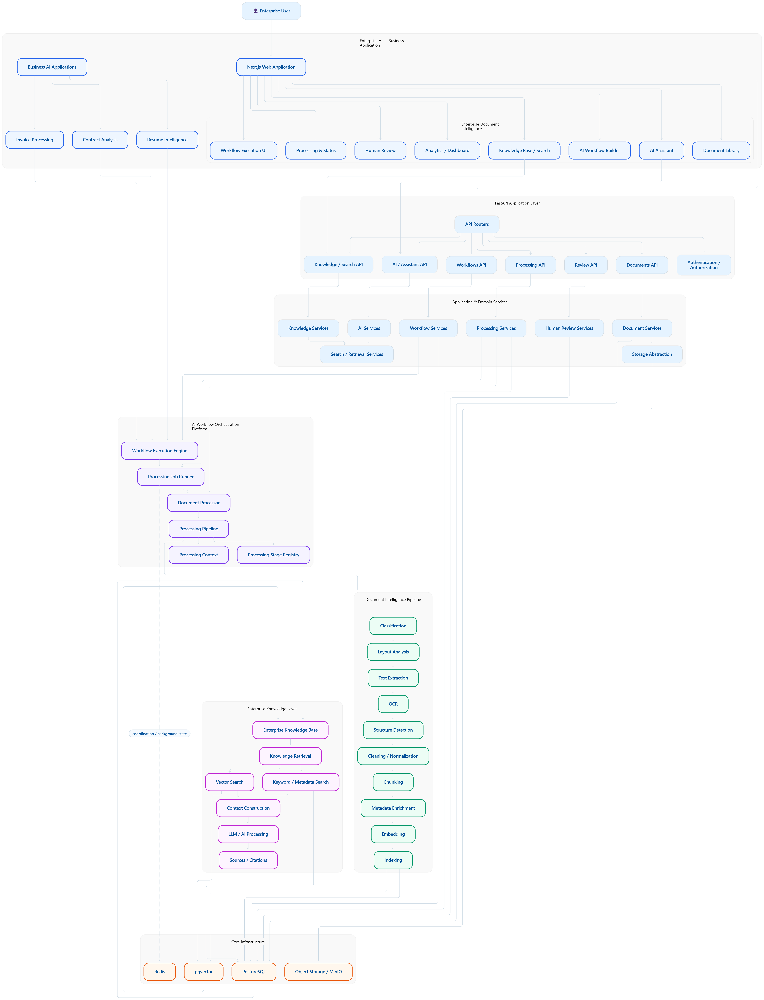

```text
Enterprise Document Intelligence   (business application)
            │
            ▼
AI Workflow Orchestration Platform (reusable infrastructure)
            │
            ▼
Core Infrastructure (PostgreSQL, pgvector, Redis, Object Storage)
```

---

## 2. System Context

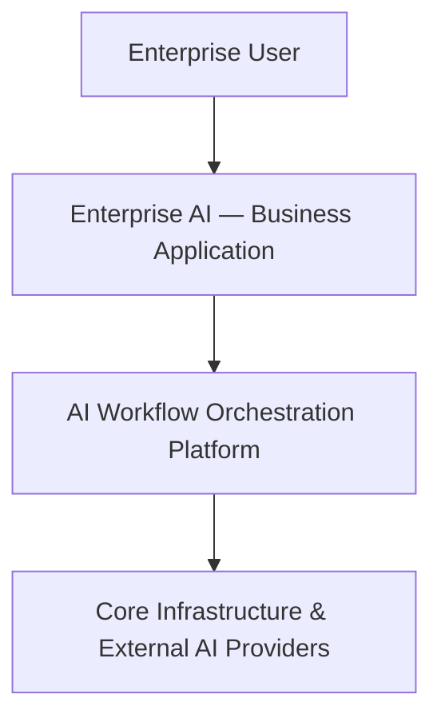

---

## 3. High-Level Architecture

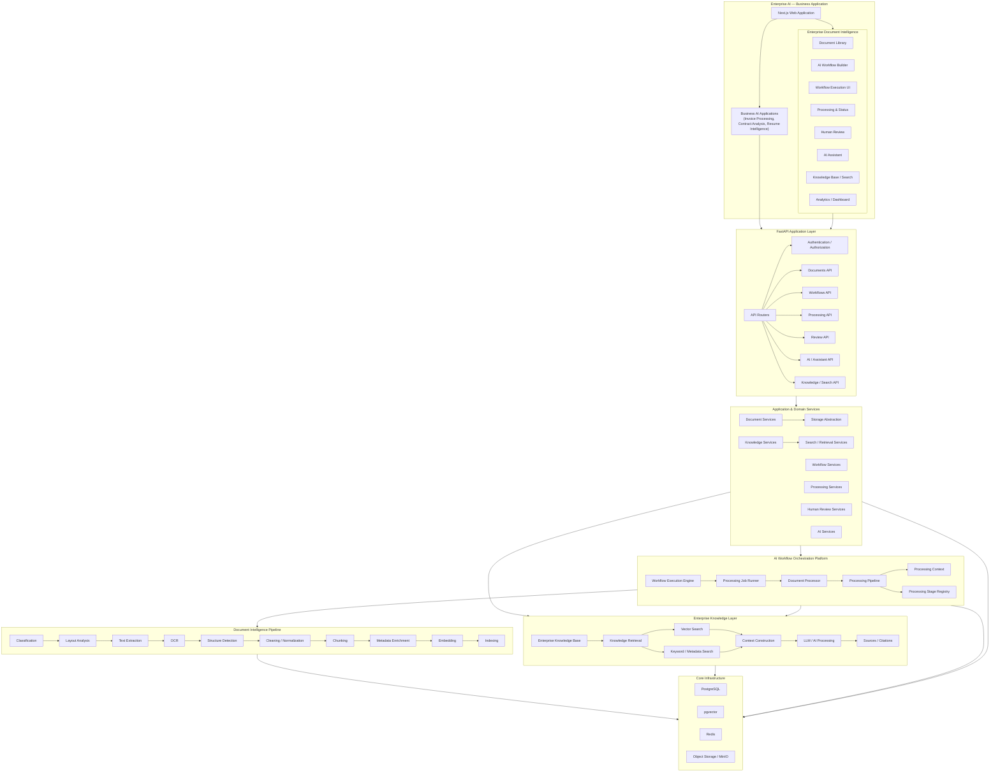

---

## 4. Component Architecture (Layered View)

| Layer | Components |
|---|---|
| **Presentation** | Next.js Web Application, Document Library, AI Workflow Builder, Workflow Execution UI, Processing & Status UI, Human Review UI, AI Assistant UI, Knowledge Base / Search UI, Analytics / Dashboard, Business AI Applications (Invoice Processing, Contract Analysis, Resume Intelligence) |
| **API** | API Routers → Authentication/Authorization, Documents API, Workflows API, Processing API, Review API, AI/Assistant API, Knowledge/Search API |
| **Application & Domain Services** | Document Services, Storage Abstraction, Workflow Services, Processing Services, Human Review Services, AI Services, Knowledge Services, Search/Retrieval Services |
| **Orchestration Platform** | Workflow Execution Engine, Processing Job Runner, Document Processor, Processing Pipeline, Processing Context, Processing Stage Registry |
| **Document Intelligence Pipeline** | Classification, Layout Analysis, Text Extraction, OCR, Structure Detection, Cleaning/Normalization, Chunking, Metadata Enrichment, Embedding, Indexing |
| **Enterprise Knowledge Layer** | Enterprise Knowledge Base, Knowledge Retrieval, Vector Search, Keyword/Metadata Search, Context Construction, LLM/AI Processing, Sources/Citations |
| **Core Infrastructure** | PostgreSQL, pgvector, Redis, Object Storage/MinIO |

Notes on the diagram's own structure:
- Business AI Applications (Invoice Processing, Contract Analysis, Resume Intelligence) are drawn as siblings of the Enterprise Document Intelligence module, both hanging off the Next.js app, and both route into the same FastAPI layer — consistent with the "business capability reuses shared infrastructure" principle from the source prompt.
- The Processing Job Runner and Workflow Execution Engine sit inside a single **AI Workflow Orchestration Platform** subgraph, meaning workflow execution and document processing execution are drawn as one runtime, not two separate engines.
- The diagram routes "coordination / background state" specifically into Redis (labeled edge), and separately routes pgvector traffic from the Enterprise Knowledge Layer — this is the clearest signal in the diagram of what each infrastructure piece is *for*.

---

## 5. Document Processing Pipeline

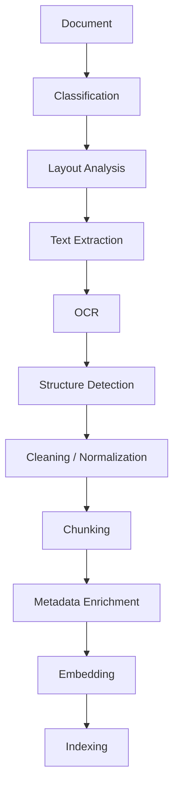

This is a strictly linear pipeline in the diagram — no branch points, conditional
stages, or parallel fan-out are shown. Whether any stage is actually
synchronous vs. asynchronous, optional vs. mandatory, or model-based vs.
deterministic is **not determinable from the diagram** and must be confirmed
against the `ProcessingPipeline` / `ProcessingStageRegistry` implementation.

---

## 6. Workflow & Job Execution

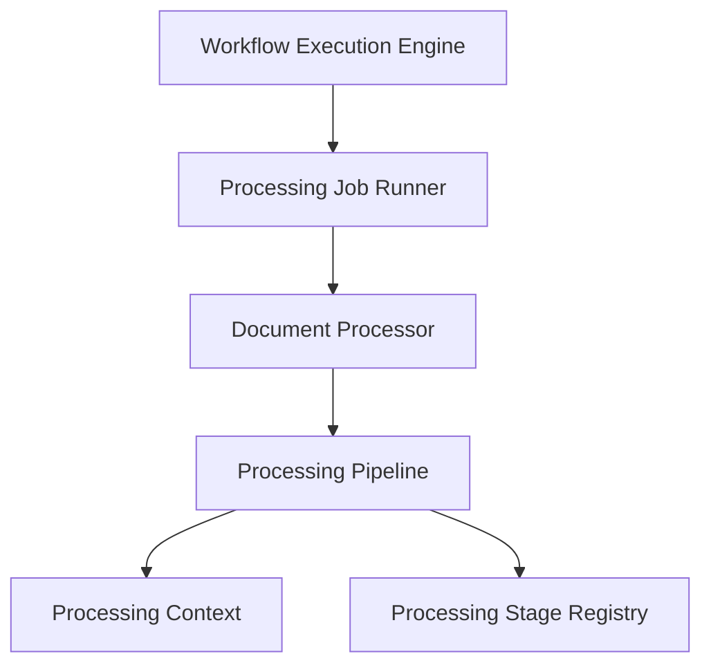

- **Processing Context** and **Processing Stage Registry** are drawn as peers
  feeding off the Processing Pipeline, matching the "context object decouples
  stages, registry decouples stage lookup from stage implementation" pattern
  described in the source prompt (§10–§11).
- The diagram does not show a distributed queue or worker pool — job execution
  is drawn as a single linear chain (Engine → Runner → Processor → Pipeline),
  so this should be documented as in-process/synchronous-style execution
  unless the actual code shows otherwise.

---

## 7. Knowledge Base & Retrieval

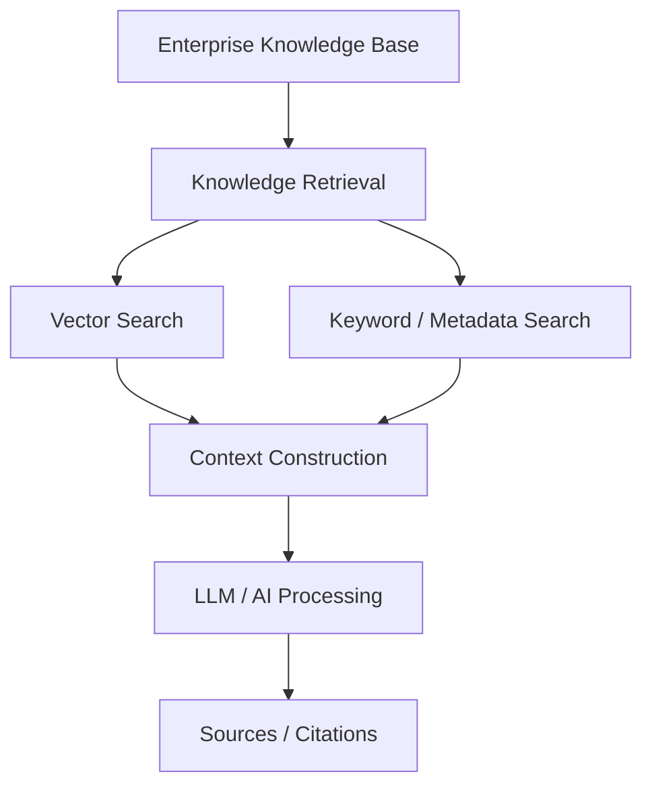

Upstream ingestion feeding this layer is the Document Intelligence Pipeline's
output (Chunking → Metadata Enrichment → Embedding → Indexing), which the
diagram routes into pgvector and, by association, into the Enterprise
Knowledge Base.

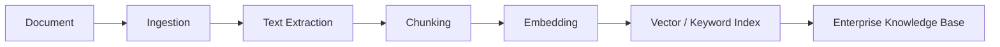

Both **Knowledge Search** (Knowledge Services → Search/Retrieval Services) and
the **AI Assistant** (AI Services) are drawn as consumers of the same
Retrieval → Context Construction → LLM chain — i.e., one retrieval pipeline
serving two front-end surfaces, not two separate retrieval stacks.

---

## 8. API Surface (as drawn)

| Router | Backing Service(s) |
|---|---|
| Authentication / Authorization | — |
| Documents API | Document Services, Storage Abstraction |
| Workflows API | Workflow Services |
| Processing API | Processing Services |
| Review API | Human Review Services |
| AI / Assistant API | AI Services |
| Knowledge / Search API | Knowledge Services, Search / Retrieval Services |

The diagram shows all seven routers hanging off a single **API Routers**
entry point inside one FastAPI application (not split into separate
deployable services) — a monolithic API layer over a set of internal
domain services.

---

## 9. Data & Infrastructure

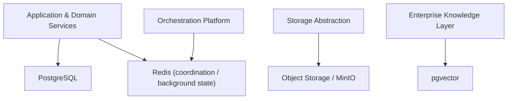

| Store | Role (as drawn) |
|---|---|
| PostgreSQL | Primary relational store for application/service state |
| pgvector | Semantic index backing Vector Search / retrieval |
| Redis | Coordination / background state (explicitly labeled on the edge in the source diagram) |
| Object Storage / MinIO | Physical document artifacts, reached only through the Storage Abstraction service, never directly by other services |

The **Storage Abstraction** node sitting between Document Services and Object
Storage is the diagram's explicit statement of the storage-provider
abstraction principle: application code depends on an internal interface, not
on MinIO/S3 directly.

---

## 10. Object Storage Architecture

The application should treat object storage through the **Storage Abstraction** rather
than coupling document-processing code directly to a provider.

The deployment-specific providers are:

| Environment | Provider | Purpose |
|---|---|---|
| Local development | **MinIO** | S3-compatible local object storage for document artifacts |
| Production | **Backblaze B2** | Production object storage using the S3-compatible interface |

This keeps the application-level storage contract stable while allowing the provider
to change by environment.

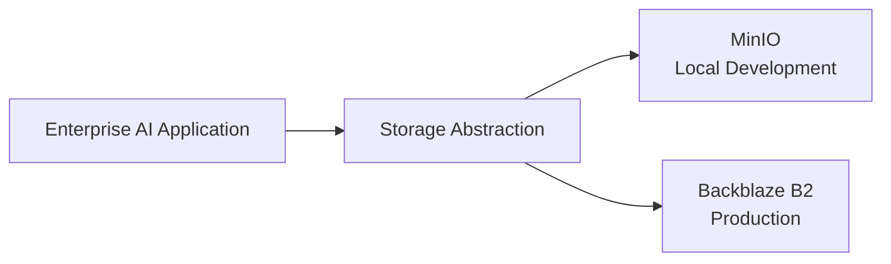

### Storage boundary

```text
Application / Document Services
              │
              ▼
      Storage Abstraction
          ┌───┴────┐
          │        │
          ▼        ▼
       MinIO      B2
       Local   Production
```

The application should not need separate business logic for MinIO versus B2. The
provider-specific configuration belongs at the infrastructure/deployment boundary.

## 11. Multi-Tenancy Note

The supplied diagram does not depict a tenant/account context, per-request
authorization scoping, or tenant-scoped query boundaries anywhere in the
flow — authentication/authorization is a single router node with no fan-out
into tenant-scoped resources. This is a **diagram gap, not a confirmed code
gap**: multi-tenancy may exist in the schema/services layer without being
visualized. This should be verified directly against the SQLAlchemy models
and service-layer query filters before drawing any conclusion about isolation
guarantees.

---


## 12. Deployment Architecture

Deployment is part of the system design because the application has different
infrastructure requirements in local development and production.

### Local development

The local environment is centered on Docker Compose and uses MinIO as the
S3-compatible object-storage provider.

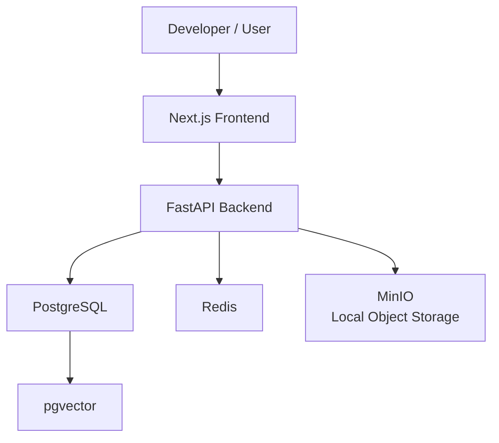

### Production

Production uses **Backblaze B2** for object storage instead of running MinIO as
the production object-storage service.

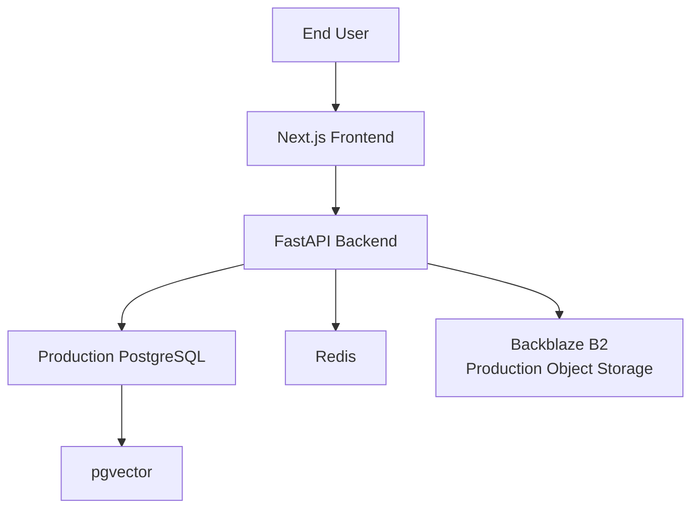

### Environment boundary

```text
                    Storage Abstraction
                           │
                 ┌─────────┴─────────┐
                 │                   │
          Development            Production
                 │                   │
                 ▼                   ▼
              MinIO              Backblaze B2
```

This is intentionally a provider substitution, not a different application
architecture. The same document-storage contract can operate against MinIO locally
and B2 in production.

### Deployment responsibilities

| Concern | Local | Production |
|---|---|---|
| Frontend | Next.js | Next.js deployment |
| API | FastAPI | FastAPI deployment |
| Relational database | PostgreSQL | Managed/production PostgreSQL |
| Vector search | pgvector | pgvector-enabled PostgreSQL |
| Coordination | Redis | Production Redis where configured |
| Object storage | **MinIO** | **Backblaze B2** |
| Configuration | `.env` / local environment | Deployment secrets/environment variables |
| TLS / public ingress | Development tooling | Production ingress / platform |

Only the provider choices explicitly established for this architecture are treated
as current. Any future worker fleet, Kubernetes deployment, CDN, service mesh, or
distributed queue should be documented separately as architectural evolution rather
than current infrastructure.

## 13. Implementation Status

| Component | Status |
|---|---|
| Next.js Web Application | Diagrammed |
| Document Library / Workflow Builder / Execution UI | Diagrammed |
| Business AI Applications (Invoice, Contract, Resume) | Diagrammed |
| FastAPI Routers (Auth, Documents, Workflows, Processing, Review, AI, Knowledge) | Diagrammed |
| Application & Domain Services layer | Diagrammed |
| Workflow Execution Engine / Job Runner / Document Processor | Diagrammed |
| Document Intelligence Pipeline (10 stages) | Diagrammed |
| Enterprise Knowledge Base / Retrieval / Vector + Keyword Search | Diagrammed |
| AI Assistant / LLM Processing / Citations | Diagrammed |
| Storage Abstraction | Diagrammed |
| PostgreSQL, pgvector, Redis, MinIO (local), Backblaze B2 (production) | Diagrammed |
| Multi-tenancy / isolation boundary | **Not shown in diagram — unverified** |
| Retry/failure handling, observability, deployment topology | **Not shown in diagram — unverified** |

---

## 14. Next Steps to Turn This Into Verified Documentation

1. Provide repo access (GitHub link, or a zip of the backend/frontend) so each
   `Diagrammed` node can be re-checked against actual routers, services,
   models, and migrations, and re-labeled `Implemented` / `Partial` /
   `Planned`.
2. Confirm which pipeline stages are synchronous vs. async, and whether job
   execution is in-process or queue-based (§5–§6 above are drawn as strictly
   linear with no queue/worker fan-out).
3. Confirm the actual Redis usage (caching vs. locks vs. job coordination) —
   the diagram only labels it generically as "coordination / background
   state."
4. Confirm tenant scoping in the database layer, since it is absent from the
   diagram itself (§10).


