Enterprise AI --- Deployment Architecture
> \*\*Enterprise Document Intelligence application powered by a reusable
> AI Workflow Orchestration Platform.\*\*
>
> This document describes the runtime and deployment boundaries of the
> Next.js frontend, FastAPI backend, document-processing engine,
> PostgreSQL/pgvector, Redis, object storage, and configurable AI
> providers.
---
1. System Context
The application is organized around four runtime boundaries:
``` text
User
  │
  ▼
Next.js Frontend
  │ HTTP / JSON
  ▼
FastAPI Backend
  │
  ▼
AI Workflow Orchestration Platform
  │
  ├── Workflow Execution
  ├── Document Processing
  ├── Knowledge / Retrieval
  └── AI Provider Integration
       │
       ▼
PostgreSQL / pgvector / Redis / Object Storage / AI Providers
```
Frontend
The Next.js application provides:
Dashboard
Document Library
Workflows
Workflow Builder
Workflow Execution
Processing Status
Knowledge Search
AI Assistant
Human Review
Analytics / execution views
The frontend communicates with the backend through HTTP APIs.
Workflow node model
``` text
Node Library
├── Input
│   └── Library Document
├── Document Processing
│   ├── OCR
│   ├── Text Extraction
│   ├── Document Classification
│   └── Document Splitting
├── Transformation
│   ├── Chunking
│   ├── Cleaning
│   └── Normalization
└── AI
    └── Extraction
```
---
2. Frontend Deployment
The frontend is a Next.js application deployed independently from the
FastAPI backend.
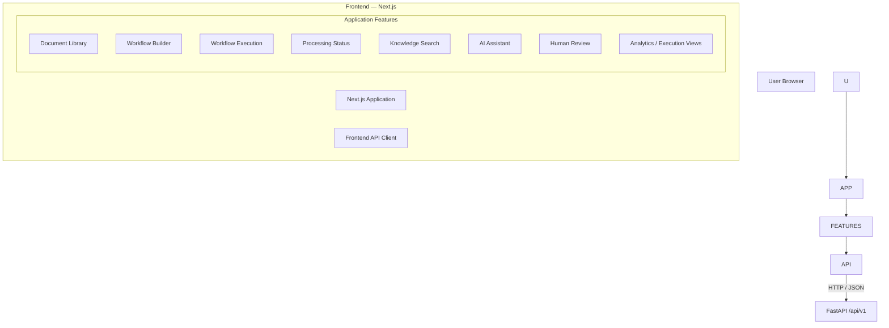
The frontend is responsible for rendering the application, collecting
user actions, submitting workflow/processing requests, and displaying
execution state and results.
The backend API base URL must be deployment-configurable. A production
build must not depend on `localhost`.
---
3. Backend Deployment
The backend is a FastAPI application exposing APIs under:
``` text
/api/v1
```
Important workflow endpoints:
``` text
/api/v1/workflows
/api/v1/workflows/{id}
/api/v1/workflows/{id}/steps
/api/v1/workflows/{id}/execute
```
Processing includes:
``` text
POST /api/v1/processing/jobs
```
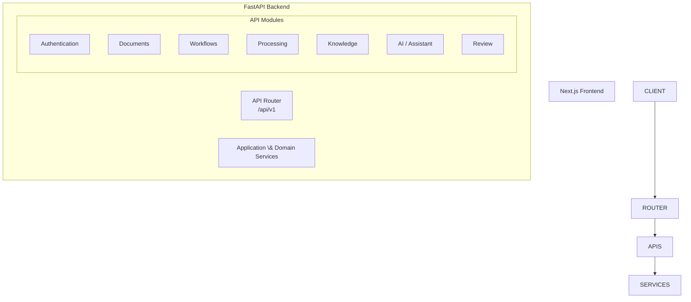
The backend is the runtime boundary between the frontend and the
reusable workflow/document-processing infrastructure.
---
4. Runtime Processing Architecture
The core processing execution path is:
``` text
ProcessingJobRunner
        ↓
DocumentProcessor
        ↓
ProcessingPipeline
        ↓
ProcessingContext
        ↓
Stage Registry
        ↓
Processing Stages
```
The processing package contains:
``` text
processing/
├── job\_runner.py
├── pipeline\_builder.py
├── processor.py
├── result\_mapper.py
├── stage\_registry.py
├── chunking/
├── classification/
├── embeddings/
├── enrichment/
├── extraction/
├── layout/
├── normalization/
├── ocr/
├── pipeline/
├── structure/
└── validators/
```
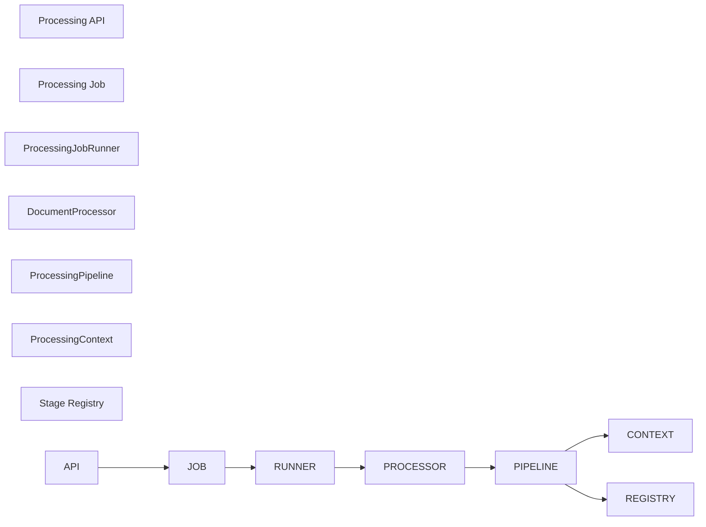
This engine executes inside the backend runtime; it is not documented as
a separate externally deployed product.
---
5. Document Processing Pipeline
``` text
Document
   ↓
Classification
   ↓
Layout Analysis
   ↓
Text Extraction / OCR
   ↓
Structure Detection
   ↓
Cleaning / Normalization
   ↓
Semantic Chunking
   ↓
Metadata Enrichment
   ↓
Embedding
   ↓
Indexing
```
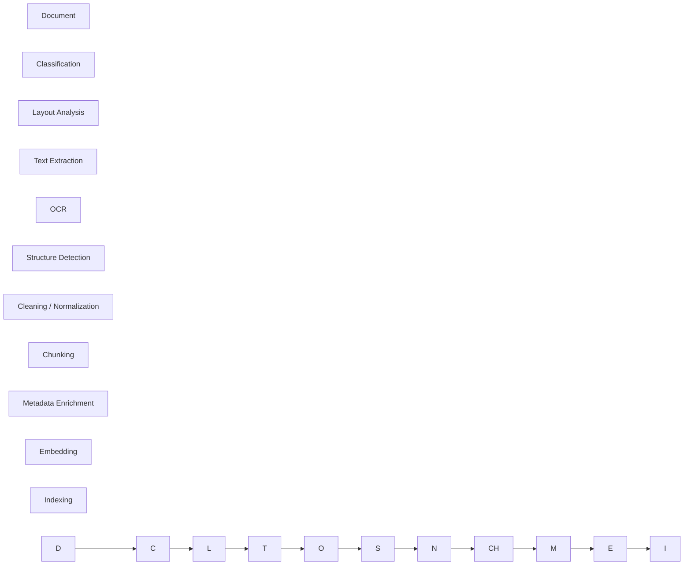
The actual provider and stage behavior is controlled by the processing
implementation and configuration.
---
6. Processing Provider Abstractions
OCR
``` text
cloud.py
paddleocr.py
tesseract.py
```
Embeddings
``` text
local.py
openai.py
voyage.py
```
Extraction
``` text
pdf.py
docx.py
xlsx.py
image.py
```
Provider adapters do not imply that every provider is enabled in
production. The active deployment configuration determines which
implementation is used.
---
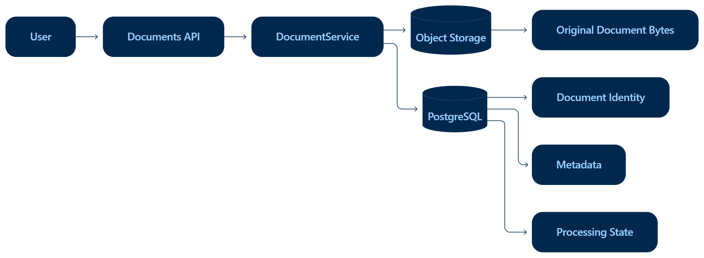
7. Storage Architecture
Physical file storage is separated from relational metadata.
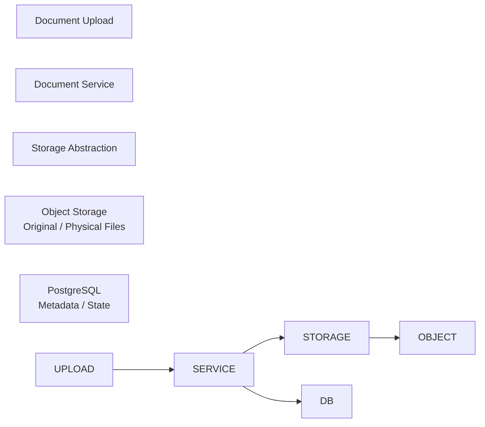
Responsibilities:
``` text
Object Storage
    → raw/original document bytes
    → physical artifacts

PostgreSQL
    → application metadata
    → document/version state
    → processing state
    → workflow state

pgvector
    → embedding vectors
    → semantic retrieval capability
```
Object-storage deployment
``` text
Local Development
    Storage Abstraction
          ↓
        MinIO
    S3-compatible storage

Production
    Storage Abstraction
          ↓
     Backblaze B2
    S3-compatible storage
```
The application should interact with the storage abstraction rather than
coupling document-processing logic directly to a provider.
---
8. Database Architecture
PostgreSQL stores transactional/application data including:
``` text
Users
Documents
Document Versions
Processing Jobs
Processing Steps
Workflows
Workflow Steps
Workflow Executions
Processing Results
Metadata
```
`pgvector` is a PostgreSQL extension/capability, not a separate
database.
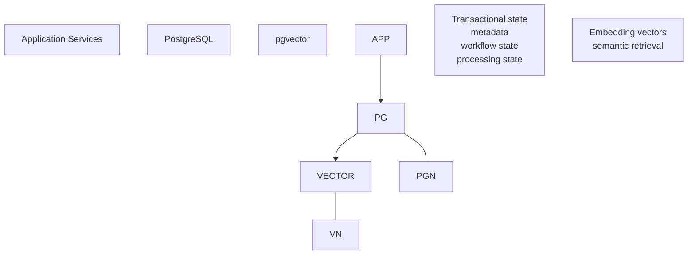
---
9. Redis
Redis is part of the runtime infrastructure.
Its exact role should follow the active repository/configuration. This
document does not assume Celery, RQ, Kafka, RabbitMQ, or another queue
system without repository evidence.
``` text
Application
     │
     ▼
   Redis
     │
     └── runtime infrastructure where configured
```
---
10. Docker Deployment
The project is containerized.
``` text
Dockerfile
    ↓
Docker Image
    ↓
Application Container
```
`docker-compose.yml` coordinates the local application stack.
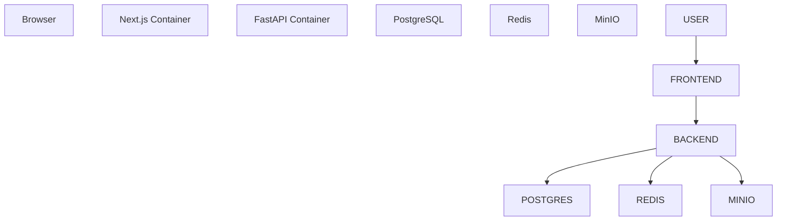
Component            Responsibility
---
Frontend container   Next.js application
Backend container    FastAPI application
PostgreSQL           Relational application state
pgvector             Vector capability inside PostgreSQL
Redis                Runtime infrastructure where configured
MinIO                Local S3-compatible object storage
Local Docker Compose should not automatically be interpreted as the
production deployment topology.
---
11. Frontend Deployment Boundary
``` text
Browser
   ↓
Next.js Frontend
   ↓
Configured Backend API
```
The backend API URL must be supplied through deployment configuration. A
production frontend should not depend on:
``` text
http://localhost:8000
```
No specific production frontend URL is assumed here.
---
12. Backend Deployment Boundary
``` text
Client
   ↓
FastAPI
   ↓
/api/v1
   ↓
Application Services
   ↓
Workflow / Processing / Knowledge Services
   ↓
Database / Storage / Redis / AI Providers
```
The backend owns API routing, authentication, application services,
workflow operations, document processing, knowledge/retrieval
operations, persistence, storage integration, and AI-provider
integration.
---
13. Environment Configuration
Deployment configuration is externalized through environment/deployment
configuration.
Conceptual groups:
``` text
Application
├── environment
├── debug/runtime settings
└── port

Database
└── database connection

Authentication
└── authentication / JWT configuration

Storage
├── endpoint/provider
├── access credentials
└── bucket configuration

Redis
└── Redis connection

AI Providers
├── LLM configuration
├── embedding configuration
└── provider-specific configuration

Frontend
└── backend API base URL
```
Only variables actually supported by the repository should be added to
an environment template.
Never commit database passwords, JWT secrets, storage credentials, AI
keys, or other secrets.
---
14. CORS
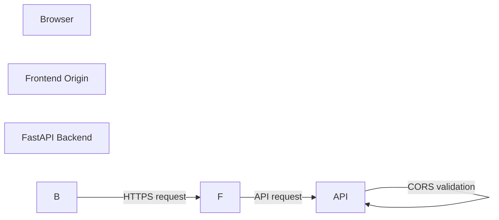
CORS is distinct from authentication and authorization:
``` text
CORS
    → controls browser-origin access

Authentication
    → identifies the user

Authorization
    → controls permitted resources/actions
```
Production CORS should allow the deployed frontend origin rather than
unrestricted origins.
---
15. Database Migrations
Where repository migration tooling is present, production schema changes
should flow through the supported migration mechanism:
``` text
Application
    ↓
Migration System
    ↓
PostgreSQL Schema
```
The exact migration command should be taken from the repository's
supported tooling rather than assumed in this document.
---
16. Production Deployment Architecture
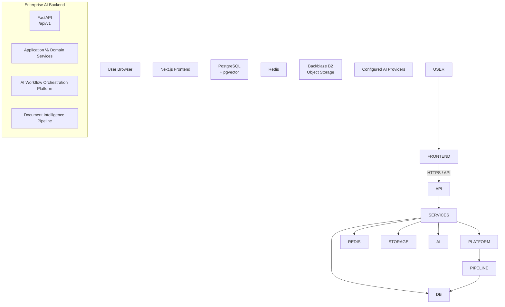
This is a logical production architecture. It does not assume a specific
cloud hosting vendor, Kubernetes cluster, load balancer, WAF, private
network, or managed service unless separately verified.
---
17. Document Processing Deployment Flow
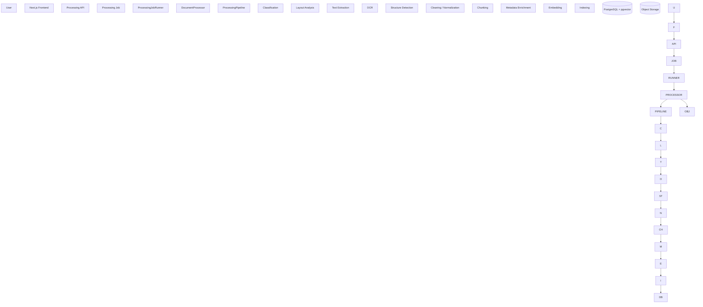
The processing engine executes within the backend application boundary.
---
18. Production Request Flow
Standard request
``` text
User
 ↓
Next.js frontend
 ↓
HTTP API
 ↓
FastAPI
 ↓
Authentication
 ↓
Application service
 ↓
Database / Storage / Processing
 ↓
Response
 ↓
Frontend
```
Workflow execution
``` text
User selects document
        ↓
User selects workflow
        ↓
Workflow execution request
        ↓
Processing job
        ↓
ProcessingJobRunner
        ↓
DocumentProcessor
        ↓
ProcessingPipeline
        ↓
Processing stages
        ↓
Embeddings / indexing where configured
        ↓
PostgreSQL / pgvector
        ↓
Processing result
        ↓
Execution UI
```
---
19. Deployment and Runtime Boundaries
Component        Responsibility
---
Frontend         User-facing application
Backend          API + application logic + workflow execution
PostgreSQL       Transactional state + metadata
pgvector         Vector retrieval capability
Object Storage   Original/physical files
Redis            Runtime infrastructure where configured
AI Providers     External model/embedding/OCR services
These responsibilities should remain separate even when multiple
components are deployed within the same environment.
---
20. Health and Observability
Health checks and observability are documented only where implemented.
Where a health endpoint exists:
``` text
Deployment
    ↓
Container starts
    ↓
Health check
    ↓
Service becomes available
```
Application-level runtime information may include processing-stage
status, processing errors/warnings, workflow execution state, execution
results, and application logs where implemented.
This document does not claim Prometheus, Grafana, OpenTelemetry,
distributed tracing, or centralized logging without verified
configuration.
---
21. Failure and Recovery
Relevant runtime failure conditions include:
``` text
Database unavailable
Storage unavailable
AI provider unavailable
Processing stage failure
Invalid document
Workflow execution failure
Container restart
```
Where implemented, processing state can be represented through:
``` text
ProcessingJob
ProcessingSteps
status
errors
warnings
result
```
No automatic retry, dead-letter queue, or distributed recovery mechanism
is claimed unless implemented.
---
22. Security During Deployment
Deployment should maintain:
secrets supplied through environment/deployment configuration;
database credentials excluded from Git;
object-storage credentials excluded from Git;
AI-provider keys excluded from Git;
authentication configuration separated from source-controlled
secrets;
production CORS restricted to the deployed frontend origin;
local and production configuration separated;
user/tenant data scoped through application authorization where
implemented.
HTTPS should be used at the deployed browser-facing boundary where
provided by the hosting environment.
This document does not claim encryption-at-rest guarantees,
customer-managed keys, private networking, WAF protection, SOC 2, HIPAA,
GDPR certification, or other compliance guarantees without explicit
implementation evidence.
---
23. Local Development vs Production
Concern          Local Development                 Production
---
Frontend         Local Next.js application         Deployed Next.js application
Backend          Local FastAPI / container         Deployed FastAPI service
Database         Configured PostgreSQL             Production PostgreSQL
Vector search    pgvector                          pgvector
Object storage   MinIO                             Backblaze B2
Redis            Configured Redis                  Configured Redis where required
Secrets          Local environment configuration   Deployment secrets
API URL          Local backend URL                 Deployed backend URL
CORS             Local frontend origin             Deployed frontend origin
---
24. Deployment Checklist
Application
[ ] Frontend production API URL configured
[ ] Backend runtime configuration configured
[ ] Backend port configured
[ ] Production CORS origin configured
[ ] Authentication configuration verified
Database
[ ] PostgreSQL connection configured
[ ] pgvector available where required
[ ] Database migrations applied through supported tooling
[ ] Database credentials excluded from Git
Storage
[ ] Object-storage provider configured
[ ] Bucket configured
[ ] Storage credentials configured securely
[ ] Local MinIO configuration verified
[ ] Production Backblaze B2 configuration verified
Runtime infrastructure
[ ] Redis configured if required
[ ] Backend starts successfully
[ ] Frontend starts successfully
[ ] Health endpoint verified if implemented
AI processing
[ ] Active AI provider configuration verified
[ ] Embedding provider configured
[ ] OCR provider configured where required
[ ] Provider credentials excluded from Git
Functional verification
[ ] Authentication verified
[ ] Document upload verified
[ ] Document storage verified
[ ] Workflow creation verified
[ ] Workflow execution verified
[ ] Processing status verified
[ ] Processing result retrieval verified
[ ] Vector indexing verified where enabled
---
25. Architecture Relationship
``` text
Enterprise Document Intelligence
        │
        ▼
AI Workflow Orchestration Platform
        │
        ├── Workflow Engine
        ├── Processing Engine
        ├── Execution Engine
        ├── AI / LLM Integration
        ├── Human Review
        ├── Integration Layer
        └── Node Registry
```
The platform is the reusable infrastructure underneath the Enterprise
Document Intelligence application. It is not presented as a separate
product that users switch into.
> \*\*The frontend is the user-facing application, while the AI Workflow
> Orchestration Platform provides the reusable execution and
> document-processing infrastructure underneath it.\*\*
---
26. Deployment Architecture Summary
Next.js provides the user-facing Enterprise AI application and
communicates with the backend through the configured API boundary.
FastAPI exposes `/api/v1` and connects frontend operations to
application and domain services.
The AI Workflow Orchestration Platform provides reusable
workflow execution and document-processing infrastructure underneath
the application.
The processing engine executes through `ProcessingJobRunner`,
`DocumentProcessor`, `ProcessingPipeline`, `ProcessingContext`, and
the stage registry.
PostgreSQL stores transactional state and metadata; pgvector
provides vector retrieval capability inside PostgreSQL.
Object storage is accessed through a storage abstraction, with
MinIO for local development and Backblaze B2 for production.
Redis is treated as runtime infrastructure whose exact role
follows the active configuration rather than an assumed queue
architecture.
External AI, OCR, and embedding providers are selected through
provider abstractions and deployment configuration.
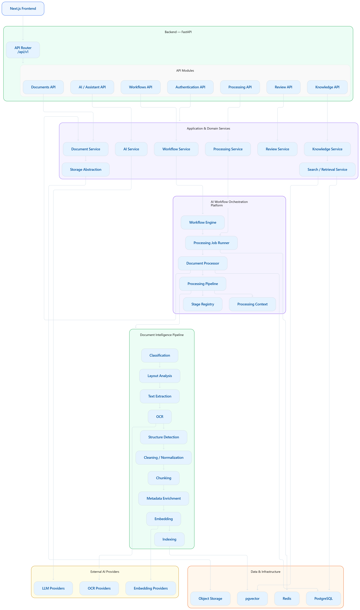