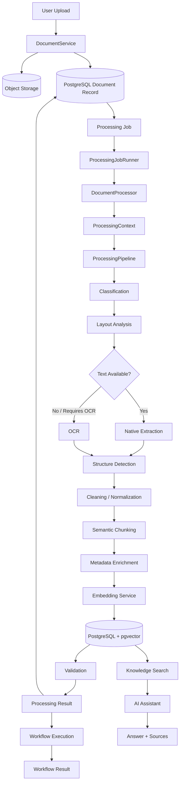
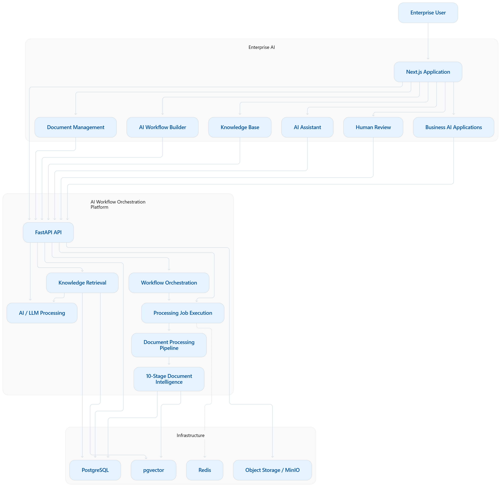
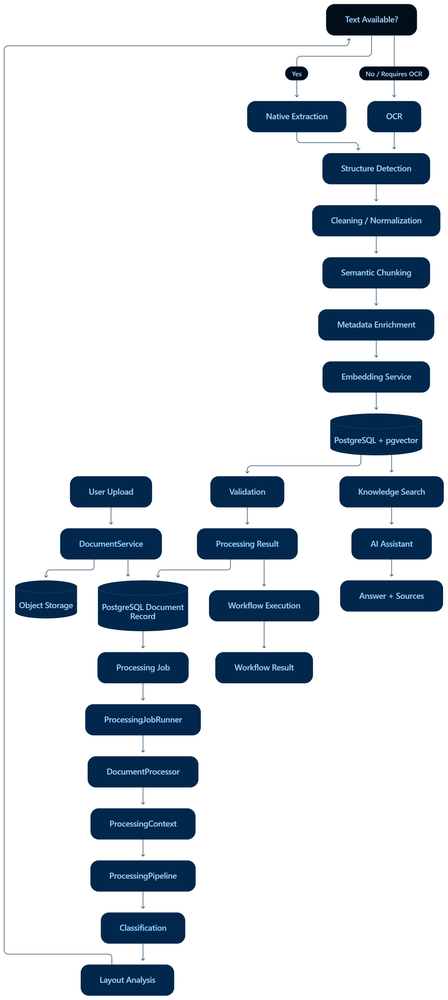
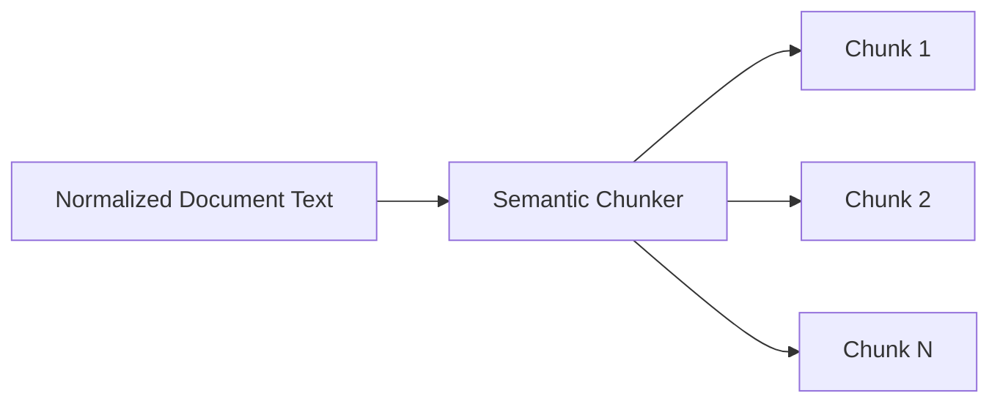

Document Processing
The Enterprise Document Intelligence application uses the AI Workflow Orchestration Platform as its reusable processing infrastructure.
The document processing engine transforms uploaded documents into structured, searchable, validated, and AI-ready representations that can subsequently be consumed by workflows, knowledge search, and AI-assisted features.
```text
Enterprise Document Intelligence
            │
            ▼
AI Workflow Orchestration Platform
            │
            ▼
Document Processing Engine
```
The processing engine is responsible for document ingestion, extraction, OCR, structure analysis, normalization, semantic chunking, metadata enrichment, embeddings, indexing, validation, and processing-result generation.
It is intentionally separated from downstream retrieval and LLM generation.
---
1. End-to-End Processing Flow
The overall processing lifecycle is:
```text
Document Upload
      ↓
Object Storage
      ↓
Document Record
      ↓
Processing Job
      ↓
ProcessingJobRunner
      ↓
DocumentProcessor
      ↓
ProcessingPipeline
      ↓
Classification
      ↓
Layout Analysis
      ↓
Native Extraction / OCR
      ↓
Structure Detection
      ↓
Cleaning / Normalization
      ↓
Semantic Chunking
      ↓
Metadata Enrichment
      ↓
Embeddings
      ↓
PostgreSQL + pgvector
      ↓
Validation / Processing Result
      ↓
Workflow / Knowledge Search / AI Assistant
```
The exact path is not necessarily identical for every document. Processing can depend on the document type, whether usable native text is available, whether OCR is required, configured providers, and the workflow in which the processing capability is being used.
---
2. Complete Processing Architecture

This diagram separates the main responsibilities:
Object Storage stores original document bytes.
PostgreSQL stores application metadata and processing state.
ProcessingJobRunner initiates processing.
DocumentProcessor coordinates document-level processing.
ProcessingPipeline executes processing stages.
Extraction/OCR obtains document content.
Chunking and enrichment create AI-ready representations.
Embedding Service generates vectors.
pgvector stores vector representations.
Validation checks processing outputs.
Workflows and retrieval consume the processed representation downstream.
---

3. Document Ingestion
Document ingestion begins when a user uploads a document through the application.
Conceptually:
```text
User
  ↓
Documents API
  ↓
DocumentService
  ├──→ Object Storage
  └──→ PostgreSQL
```
The system separates the original document from its application metadata.
Object Storage
Object storage contains the original binary document:
```text
PDF
DOCX
XLSX
Image
```
The application uses a storage abstraction so the concrete storage implementation can be configured independently from higher-level document-processing logic.
PostgreSQL
PostgreSQL stores application-level information associated with the document, such as its identity, metadata, and processing-related state.
This separation prevents the relational database from becoming the primary storage location for large binary document contents.
Conceptually:
```text
Object Storage
    ↓
Original Document Bytes

PostgreSQL
    ↓
Document Identity
Metadata
Processing State
Application State
```
---

4. Supported Document Types
The extraction subsystem contains implementations for:
```text
PDF
DOCX
XLSX
Image
```
The corresponding processing responsibility is:
Document Type	Processing Role
PDF	PDF document/text extraction
DOCX	Document text and structure extraction
XLSX	Spreadsheet content extraction
Image	OCR-oriented processing
The extraction layer provides a common abstraction so document processing does not need to depend directly on one extraction implementation.
The exact extraction path depends on the document and configured processing capabilities.
---
5. Processing Package
The main processing package is organized around specialized processing responsibilities:
```text
processing/
├── job_runner.py
├── pipeline_builder.py
├── processor.py
├── result_mapper.py
├── stage_registry.py
│
├── chunking/
│   ├── chunker.py
│   ├── models.py
│   └── semantic.py
│
├── classification/
│   ├── classifier.py
│   └── models.py
│
├── embeddings/
│   ├── manager.py
│   ├── service.py
│   └── providers/
│       ├── local.py
│       ├── openai.py
│       └── voyage.py
│
├── enrichment/
│   ├── enricher.py
│   └── models.py
│
├── extraction/
│   ├── base.py
│   ├── docx.py
│   ├── image.py
│   ├── manager.py
│   ├── pdf.py
│   └── xlsx.py
│
├── layout/
│   ├── analyzer.py
│   └── models.py
│
├── normalization/
│   ├── cleaner.py
│   ├── models.py
│   └── normalizer.py
│
├── ocr/
│   ├── base.py
│   ├── manager.py
│   └── providers/
│       ├── cloud.py
│       ├── paddleocr.py
│       └── tesseract.py
│
├── pipeline/
│   ├── context.py
│   ├── pipeline.py
│   └── result.py
│
├── structure/
│   ├── detector.py
│   └── models.py
│
└── validators/
    ├── base.py
    ├── confidence_validator.py
    └── field_validator.py
```
These modules can be grouped into the following logical layers:
Layer	Responsibility
Job execution	Starts processing jobs
Pipeline orchestration	Builds and executes processing stages
Extraction	Obtains document content
OCR	Handles recognition when required
Classification	Determines document characteristics
Layout	Provides document layout information
Structure	Detects logical document structure
Normalization	Cleans and standardizes extracted content
Chunking	Converts documents into retrieval-sized units
Enrichment	Adds processing and document metadata
Embeddings	Converts content into vectors
Validation	Checks extracted/processed results
Result mapping	Converts pipeline state into application results
---
6. ProcessingJobRunner
The `ProcessingJobRunner` provides the execution entry point for a document-processing job.
The conceptual relationship is:
```text
ProcessingJob
      ↓
ProcessingJobRunner
      ↓
DocumentProcessor
```
The runner takes the processing job and initiates document processing.
The job provides the identity and state needed to associate processing with the correct document.
The runner then invokes the document processor rather than implementing all document-processing logic itself.
This keeps job execution separate from document transformation.
---
7. DocumentProcessor
The `DocumentProcessor` is the application-level coordinator for document processing.
The main relationship is:
```text
ProcessingJobRunner
        ↓
DocumentProcessor
        ↓
ProcessingPipeline
```
The processor is responsible for preparing document processing and coordinating the pipeline execution.
It also provides the boundary between the application-level processing job and the lower-level processing stages.
Conceptually:
```text
Processing Job
      ↓
DocumentProcessor
      ↓
Processing Context
      ↓
Processing Pipeline
      ↓
Pipeline Result
      ↓
Processing Job Result
```
This prevents the processing job itself from needing to understand the implementation details of extraction, chunking, embeddings, or other processing stages.
---
8. ProcessingContext
A central architectural component is the `ProcessingContext`.
The context acts as shared state for the processing pipeline.
Conceptually it contains information such as:
```text
document_id
file_path
raw_text
cleaned_text
chunks
embeddings
indexing_result
metadata
stage_results
errors
warnings
```
The context can be viewed as:
```text
                    ProcessingContext
                           │
          ┌────────────────┼────────────────┐
          │                │                │
      Input State      Intermediate      Output State
          │                │                │
     document_id       raw_text          chunks
     file_path         cleaned_text      embeddings
                       metadata          indexing
                       stage_results     errors
                                         warnings
```
Each stage can consume the relevant state and contribute its own output.
For example:
```text
Extraction
    ↓
raw_text

Normalization
    ↓
cleaned_text

Chunking
    ↓
chunks

Embedding
    ↓
embeddings

Indexing
    ↓
indexing_result
```
This shared context reduces coupling between processing stages.
Instead of every stage directly depending on every other stage, stages communicate through structured processing state.
---
9. ProcessingPipeline
The `ProcessingPipeline` coordinates execution of the processing stages.
Conceptually:
```text
Document
   ↓
ProcessingContext
   ↓
ProcessingPipeline
   ↓
Processing Stages
   ↓
Pipeline Result
```
The pipeline is responsible for orchestration rather than implementing every processing operation itself.
This distinction is important:
```text
Pipeline
→ controls processing flow

Processing Stage
→ performs one specific processing responsibility
```
The pipeline therefore acts as the execution framework for document transformation.
---
10. Stage Registry and Pipeline Builder
The processing system contains:
```text
stage_registry.py
pipeline_builder.py
```
These components separate stage availability and pipeline construction from the actual execution logic.
Conceptually:
```text
Stage Registry
      ↓
Available Processing Stages
      ↓
Pipeline Builder
      ↓
ProcessingPipeline
      ↓
Execution
```
The architecture allows processing stages to be assembled without placing all processing logic inside a single monolithic function.
This provides a cleaner extension boundary for additional processing capabilities.
The implementation should not be interpreted as a general-purpose user plugin marketplace. The registry and builder are internal processing architecture components.
---
11. Document Classification
The classification subsystem contains:
```text
classification/
├── classifier.py
└── models.py
```
Classification determines useful characteristics of the document for downstream processing.
Conceptually:
```text
Document
   ↓
Classifier
   ↓
Classification Information
   ↓
Processing Decisions
```
Classification is separated from extraction and downstream transformation.
Business document types exposed by the application can represent application use cases, but they should not automatically be interpreted as hard-coded classifier categories unless explicitly represented by the implementation.
---
12. Layout Analysis
The layout subsystem contains:
```text
layout/
├── analyzer.py
└── models.py
```
Layout analysis provides structural information about a document.
Document content can contain different forms of organization, including:
```text
Paragraphs
Headings
Tables
Columns
Forms
Images
Spatial Structure
```
The layout analyzer exists to make document structure available to downstream processing stages.
The implementation should not be described as using a specific computer-vision or layout-transformer model unless such a model is explicitly configured.
---
13. Native Text Extraction and OCR
The extraction system supports document-specific extraction implementations:
```text
extraction/
├── base.py
├── docx.py
├── image.py
├── manager.py
├── pdf.py
└── xlsx.py
```
The system also contains an OCR abstraction:
```text
ocr/
├── base.py
├── manager.py
└── providers/
    ├── cloud.py
    ├── paddleocr.py
    └── tesseract.py
```
The conceptual decision is:
```text
                    Document
                       │
                       ▼
                Text Available?
                  /          \
                Yes           No
                /              \
               ▼                ▼
      Native Extraction        OCR
               \              /
                \            /
                 ▼          ▼
               Extracted Content
                       │
                       ▼
              Structure Detection
```
Native extraction is preferable when usable document text is already available.
OCR provides an alternative processing path when the document requires text recognition.
The OCR abstraction consists of:
```text
OCR Manager
     ↓
OCR Provider
     ↓
OCR Result
```
The provider layer contains implementations for:
```text
Cloud
PaddleOCR
Tesseract
```
The existence of these implementations does not mean that every provider runs for every document or that every provider is active in production simultaneously.
The abstraction allows the OCR implementation to remain separate from the rest of the processing pipeline.
---
14. Structure Detection
The structure subsystem contains:
```text
structure/
├── detector.py
└── models.py
```
Structure detection transforms extracted information into a more useful logical representation.
Conceptually:
```text
Extracted Content
        ↓
Structure Detection
        ↓
Logical Document Structure
```
The purpose is to preserve useful relationships and boundaries in the extracted document rather than treating the entire document as undifferentiated text.
Exact structural output should be determined by the implementation rather than assumed from the general concept of document intelligence.
---
15. Cleaning and Normalization
The normalization subsystem contains:
```text
normalization/
├── cleaner.py
├── models.py
└── normalizer.py
```
There are two related responsibilities.
Cleaning
Cleaning addresses undesirable artifacts introduced during extraction or OCR.
Examples of possible text artifacts include:
```text
Excess whitespace
Unwanted line breaks
Extraction artifacts
OCR artifacts
```
Only transformations implemented by the cleaner should be considered actual system behavior.
Normalization
Normalization converts processed content into a consistent representation suitable for downstream stages.
Conceptually:
```text
Raw Extracted Content
        ↓
Cleaner
        ↓
Normalizer
        ↓
Normalized Content
```
Normalization prepares content for semantic chunking and downstream AI processing.
---
16. Semantic Chunking
The chunking subsystem contains:
```text
chunking/
├── chunker.py
├── models.py
└── semantic.py
```
Chunking converts a document into smaller processing and retrieval units.
Conceptually:
```text
Document
   ↓
Normalized Text
   ↓
Semantic Chunker
   ↓
Chunks
```
Large documents are not naturally suited to being treated as one giant retrieval unit.
The chunking layer therefore creates smaller pieces of content that can subsequently be embedded and indexed.
The semantic chunking implementation is intended to preserve meaningful context rather than relying solely on arbitrary text boundaries.
Exact chunk sizes and algorithm parameters should be taken from the implementation/configuration rather than assumed.

---
17. Metadata Enrichment
The enrichment subsystem contains:
```text
enrichment/
├── enricher.py
└── models.py
```
Enrichment attaches useful contextual information to processed content.
Conceptually:
```text
Chunk
   +
Document Metadata
   +
Processing Metadata
   ↓
Enriched Chunk
```
Metadata can represent categories such as:
```text
Document identity
Source information
Structural information
Processing information
```
The exact metadata fields should follow the implementation rather than being inferred from this conceptual model.
Enrichment is useful because retrieval and downstream processing often need more information than the raw chunk text alone.
---
18. Embeddings
The embedding subsystem contains:
```text
embeddings/
├── manager.py
├── service.py
└── providers/
    ├── local.py
    ├── openai.py
    └── voyage.py
```
The conceptual flow is:
```text
Processed Chunks
      ↓
Embedding Service
      ↓
Embedding Provider
      ↓
Vectors
```
The provider abstraction separates vector generation from the rest of the document-processing pipeline.
Conceptually:
```text
EmbeddingService
       ↓
Provider Interface
       ↓
┌──────────────┬───────────────┬───────────────┐
│ Local        │ OpenAI        │ Voyage        │
└──────────────┴───────────────┴───────────────┘
       ↓
     Vectors
```
The repository contains implementations for:
```text
Local
OpenAI
Voyage
```
This does not imply that all providers are active simultaneously or that a particular provider is necessarily the production configuration.
The selected provider depends on application configuration.
Vector dimensions and model-specific characteristics should likewise be taken from the active configuration rather than assumed.
---
19. Vector Storage and pgvector
Generated embeddings can be stored in PostgreSQL using `pgvector`.
The conceptual flow is:
```text
Chunk
  ↓
Embedding
  ↓
PostgreSQL + pgvector
```
A vector representation is associated with the processed document content and its relevant metadata.
Conceptually:
```text
Vector
   +
Chunk
   +
Document Identity
   +
Metadata
```
The resulting representation supports semantic retrieval over processed document content.
The embedding provider creates the vector.
`pgvector` provides the database-side representation and retrieval capability.
These are separate responsibilities:
```text
Embedding Provider
        ↓
Creates vectors

pgvector
        ↓
Stores and searches vectors
```
No specific vector indexing algorithm should be assumed unless configured by the implementation.
---
20. Processing Results
The processing result is represented by:
```text
pipeline/result.py
result_mapper.py
```
The conceptual flow is:
```text
ProcessingContext
      ↓
Pipeline Result
      ↓
Result Mapper
      ↓
Processing Job Result
      ↓
PostgreSQL
```
The result represents the outcome of processing rather than simply storing raw extracted text.
Depending on the implementation, processing state can include concepts such as:
```text
Status
Stage Results
Metadata
Processed Content
Errors
Warnings
```
The result mapper provides the boundary between pipeline-level results and application-level processing-job state.
---
21. Validation
The validation subsystem contains:
```text
validators/
├── base.py
├── confidence_validator.py
└── field_validator.py
```
Validation provides a quality-control layer for extracted or AI-generated processing results.
Conceptually:
```text
Extraction / AI Result
        ↓
Validation
        ├── Field Validation
        └── Confidence Validation
        ↓
Validated Result
```
Field Validation
Field validation checks whether relevant extracted fields satisfy the validation logic implemented by the application.
Confidence Validation
Confidence validation provides a mechanism for evaluating the confidence associated with processing results.
The system should not be assumed to use a particular confidence threshold unless that threshold is explicitly defined in configuration or code.
Validation can therefore identify results that require additional handling before they are treated as downstream-ready output.
---
22. Workflow Integration
The document-processing engine is consumed by the workflow orchestration layer.
A typical conceptual flow is:
```text
Document Library
       ↓
Select Document
       ↓
Select Workflow
       ↓
POST /processing/jobs
       ↓
ProcessingJob
       ↓
ProcessingJobRunner
       ↓
DocumentProcessor
       ↓
ProcessingPipeline
       ↓
Processing Result
       ↓
Execution UI
```
The processing engine provides reusable document-processing capabilities.
The workflow layer determines how those capabilities participate in a broader workflow execution.
This creates a separation:
```text
Workflow Engine
        ↓
Composes / coordinates execution

Processing Engine
        ↓
Performs document-processing operations
```
The document processor therefore does not need to be redesigned for every workflow.
---
23. Knowledge Base Integration
Processed documents can become part of the enterprise knowledge representation.
The basic flow is:
```text
Document
   ↓
Processing
   ↓
Chunks
   ↓
Embeddings
   ↓
pgvector
   ↓
Knowledge Search
```
Knowledge search then becomes a downstream consumer of processed document data.
Conceptually:
```text
Processed Document
        ↓
Chunks + Metadata
        ↓
Embeddings
        ↓
pgvector
        ↓
Semantic Retrieval
        ↓
Relevant Content
```
---
24. AI Assistant Integration
The AI assistant is downstream from document processing.
The distinction is important:
```text
Document Processing
        ↓
Creates AI-ready data

Retrieval
        ↓
Finds relevant data

LLM / Assistant
        ↓
Generates an answer using retrieved context
```
A conceptual assistant flow is:
```text
User Question
      ↓
Knowledge Search
      ↓
Relevant Chunks
      ↓
Retrieved Context
      ↓
LLM
      ↓
Answer + Sources
```
The LLM is therefore not the document processor itself.
The document-processing engine prepares the information that downstream retrieval and AI systems can consume.
---
25. End-to-End Example: `Financials_Q2.xlsx`
Consider a document named:
```text
Financials_Q2.xlsx
```
The conceptual lifecycle is:
```text
Financials_Q2.xlsx
        ↓
Object Storage
        ↓
Document Record
        ↓
Processing Job
        ↓
XLSX Extraction
        ↓
Classification
        ↓
Structure Detection
        ↓
Cleaning / Normalization
        ↓
Semantic Chunking
        ↓
Metadata Enrichment
        ↓
Embeddings
        ↓
PostgreSQL + pgvector
        ↓
Validation / Processing Result
        ↓
Knowledge Search / AI Assistant / Workflow
```
Step 1 — Upload
The user uploads `Financials_Q2.xlsx`.
The original file is placed into the configured object-storage layer, while the application maintains a corresponding document record.
Step 2 — Processing Job
A processing job associates the document with the processing execution.
The job is passed to the `ProcessingJobRunner`.
Step 3 — XLSX Extraction
The XLSX extraction implementation obtains the spreadsheet content.
The extracted representation becomes part of the `ProcessingContext`.
Step 4 — Classification
The classification stage processes the document characteristics needed by the downstream pipeline.
Step 5 — Structure Detection
Spreadsheet content has its own structural organization.
The structure-processing layer converts extracted information into a representation suitable for later processing.
Step 6 — Cleaning and Normalization
Extracted content is cleaned and normalized before being passed to chunking.
Step 7 — Chunking
The normalized content is divided into processing/retrieval units.
Step 8 — Metadata Enrichment
The chunks receive relevant document and processing metadata.
Step 9 — Embeddings
The configured embedding provider converts processed chunks into vectors.
Step 10 — Vector Storage
The vectors can be stored in PostgreSQL through `pgvector`.
Step 11 — Downstream Consumption
The processed representation can subsequently support:
```text
Knowledge Search
AI Assistant
Workflow Execution
```
No exact spreadsheet values are assumed by the processing architecture.
---
26. Failure Handling
The processing context provides state for:
```text
errors
warnings
stage_results
```
This allows processing outcomes to retain information about problems encountered during execution.
Relevant failure categories include:
```text
Unsupported file
Extraction failure
OCR failure
Classification failure
Embedding failure
Indexing failure
Validation failure
```
The precise behavior for each category depends on the implementation.
For example:
```text
Processing Stage
      ↓
Failure / Warning
      ↓
Processing Context
      ↓
Processing Result
```
The architecture should not be interpreted as providing automatic retries unless retry behavior is explicitly implemented.
---
27. Extensibility
The processing architecture uses abstraction boundaries at several levels.
Processing Providers
Provider abstractions allow implementations to be changed independently.
Examples include:
```text
OCR Provider
     ↓
Cloud / PaddleOCR / Tesseract
```
and:
```text
Embedding Provider
     ↓
Local / OpenAI / Voyage
```
Processing Stages
The stage registry and pipeline builder separate stage construction from pipeline execution.
Conceptually:
```text
Processing Stage
       ↓
Stage Registry
       ↓
Pipeline Builder
       ↓
Processing Pipeline
```
This creates an architectural extension point for additional processing stages.
Possible future additions could include:
```text
New OCR Provider
New Embedding Provider
New Extractor
New Processing Stage
New Validator
New Enrichment Stage
```
These are extension possibilities supported by the architecture; they should not be interpreted as currently implemented capabilities.
---
28. Important Architectural Distinctions
Object Storage vs PostgreSQL
```text
Object Storage
    ↓
Original Binary Documents

PostgreSQL
    ↓
Document Metadata
Processing State
Application State
```
Object storage handles the document itself.
PostgreSQL handles application-level information about that document.
---
Processing vs Retrieval
```text
Processing
    ↓
Transforms Documents
    ↓
Creates Searchable / AI-ready Data

Retrieval
    ↓
Searches Processed Data
    ↓
Returns Relevant Content
```
Processing happens before retrieval.
Retrieval consumes the representations produced by processing.
---
Processing vs LLM
```text
Processing Engine
    ↓
Extraction
Normalization
Chunking
Embeddings
Validation
Indexing

LLM
    ↓
Uses Retrieved Context
    ↓
Generates Responses
```
The processing engine does not need an LLM to perform every stage.
LLM generation is a downstream capability.
---
Workflow Engine vs Processing Engine
```text
Workflow Engine
    ↓
Coordinates / Composes Execution

Processing Engine
    ↓
Executes Document Processing
```
The workflow layer can consume processing capabilities without embedding all processing logic inside the workflow system.
---
Embedding Provider vs Vector Database
```text
Embedding Provider
    ↓
Creates Vector

pgvector
    ↓
Stores / Searches Vector
```
The provider and vector database therefore have different responsibilities.
---
29. Design Principles
The document-processing architecture reflects several design principles.
1. Separation of Concerns
Document ingestion, processing, storage, embedding, validation, and downstream execution are separated into distinct responsibilities.
2. Provider Abstraction
OCR and embedding providers are abstracted from the core processing pipeline.
3. Pipeline-Based Processing
Document transformation is organized as a sequence of processing stages rather than one monolithic operation.
4. Shared Processing Context
`ProcessingContext` provides a structured state boundary between stages.
5. Stage-Based Extensibility
The stage registry and pipeline builder provide an architectural mechanism for assembling processing stages.
6. Storage Separation
Original document bytes and application metadata are handled by different storage responsibilities.
7. AI-Ready Document Representation
Extraction, normalization, chunking, enrichment, and embeddings transform raw documents into representations suitable for downstream AI features.
8. Validation Before Downstream Consumption
Validation provides a quality-control boundary before processed results are consumed downstream.
9. Reusable Processing Capabilities
The processing engine is not tied to a single business workflow.
10. Workflow Integration Without Tight Coupling
Workflows can consume document-processing capabilities while the processing implementation remains a separate subsystem.
---
30. Processing Summary
The complete document lifecycle can be summarized as:
```text
Document
   ↓
Ingestion
   ↓
Extraction / OCR
   ↓
Classification + Structure
   ↓
Cleaning / Normalization
   ↓
Semantic Chunking
   ↓
Metadata Enrichment
   ↓
Embeddings
   ↓
pgvector
   ↓
Validation / Results
   ↓
Workflow / Knowledge Search / AI Assistant
```
The key architectural points are:
Original documents are stored through the application's object-storage abstraction.
Document metadata and processing state are maintained in PostgreSQL.
Processing jobs are initiated through `ProcessingJobRunner`.
DocumentProcessor coordinates document-level processing and invokes the processing pipeline.
OCR and extraction are separated behind dedicated abstractions and provider implementations.
Extracted content is cleaned, normalized, structurally processed, and converted into semantic chunks.
Embedding providers convert processed chunks into vector representations.
PostgreSQL with pgvector provides storage for vector representations used by downstream semantic retrieval.
Validation and result mapping convert pipeline state into application-level processing results.
Workflows, knowledge search, and AI assistant capabilities consume the processed representation rather than being embedded inside the document-processing engine.
The resulting architecture provides a reusable path from:
```text
Raw Enterprise Document
        ↓
Structured Processing State
        ↓
Searchable / AI-ready Representation
        ↓
Workflow and AI Consumption
```

