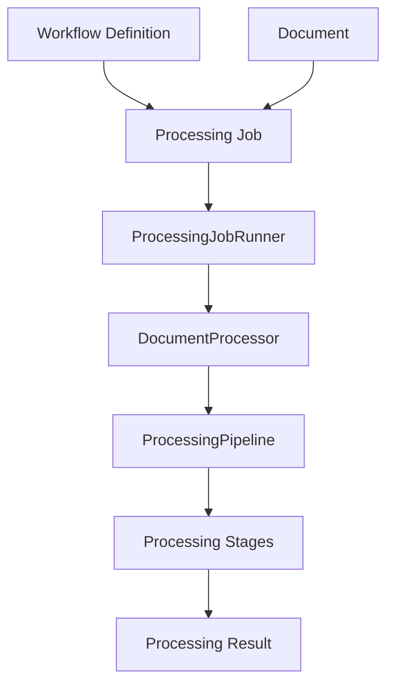
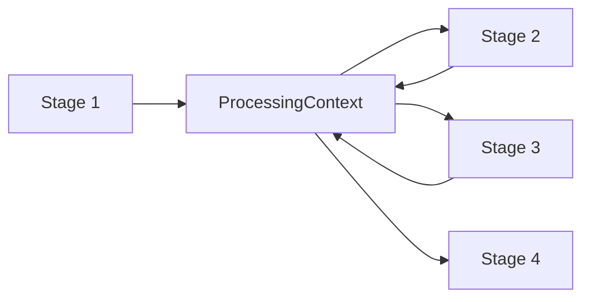
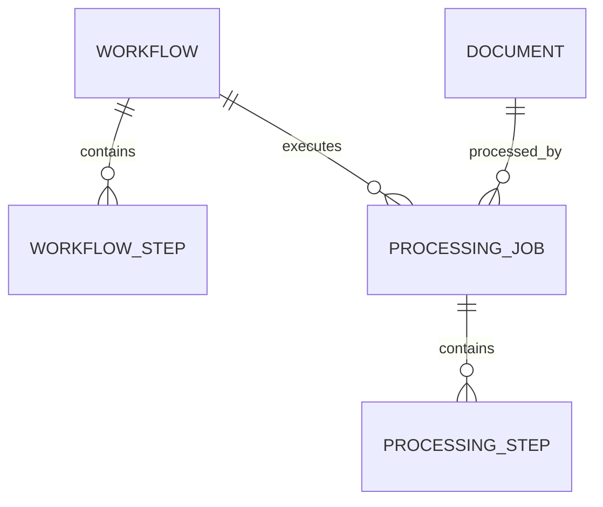
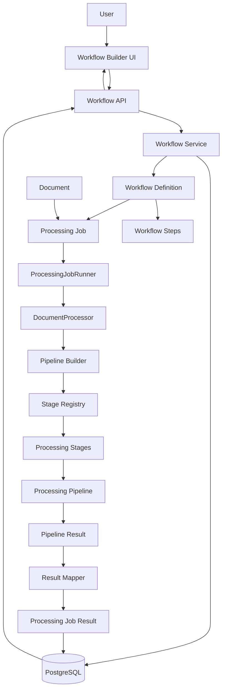
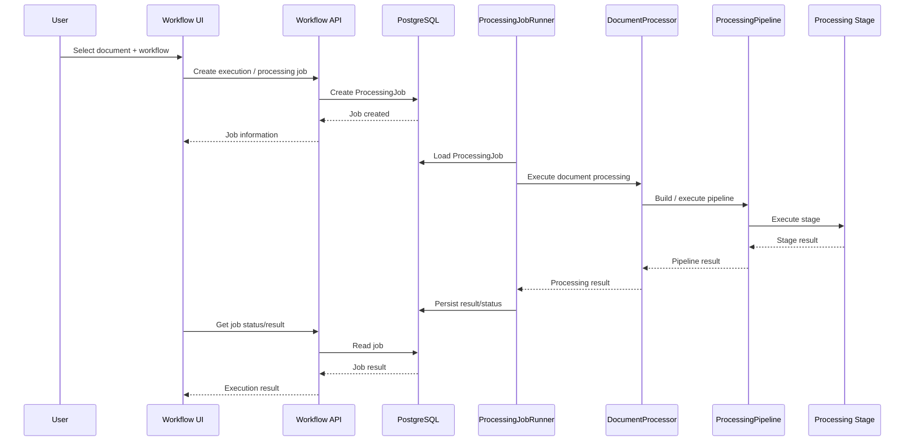
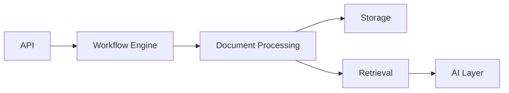
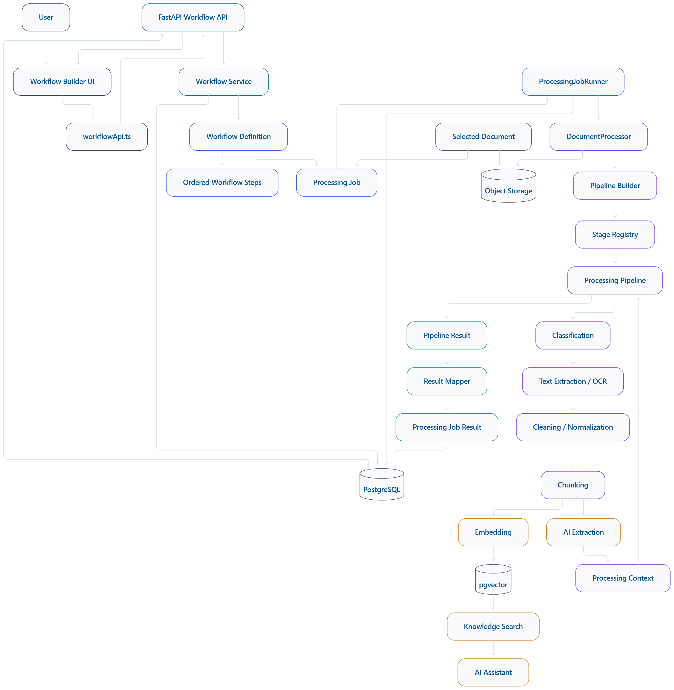

Workflow Engine
> **Enterprise Document Intelligence / AI Workflow Orchestration Platform**  
> Workflow definition · Processing-job orchestration · Pipeline construction · Stage execution · Result persistence
Overview
The Workflow Engine is the orchestration layer of the Enterprise Document Intelligence platform. It connects user-defined workflow configurations with the document-processing engine.
Its primary responsibility is to determine what processing should be executed and in what order, create and track an execution instance, and expose the resulting execution state to the application.
The workflow engine does not implement OCR, extraction, chunking, embedding, indexing, or LLM generation itself. Those capabilities belong to the document-processing and downstream AI layers.
At a high level:
```text
Create Workflow
      ↓
Configure Workflow Steps
      ↓
Select Input Document
      ↓
Create Processing Job
      ↓
Execute Workflow
      ↓
Run Processing Stages
      ↓
Persist Step / Job Results
      ↓
Return Execution Result
```
The implementation sits between the application/API layer and the document-processing pipeline:
```text
Next.js Frontend
      ↓
Workflow API
      ↓
Workflow Definition / Execution Layer
      ↓
Processing Jobs
      ↓
ProcessingJobRunner
      ↓
DocumentProcessor
      ↓
ProcessingPipeline
      ↓
Processing Stages
      ↓
Results
```
For the broader system architecture, see `architecture.md`. For detailed document-processing behavior, see `document-processing.md`.
---
Responsibilities
The workflow engine is responsible for:
Creating workflows
Updating workflows
Retrieving workflows
Managing workflow steps
Maintaining step ordering
Validating workflow definitions and configuration at the orchestration boundary
Associating workflows with documents and processing jobs
Creating processing jobs
Starting workflow execution
Coordinating execution through the processing layer
Tracking processing-job state
Persisting execution results
Reporting execution state to the frontend
Propagating execution failures
The workflow engine does not own the implementation of:
OCR algorithms
PDF/DOCX/XLSX extraction algorithms
Text-cleaning algorithms
Chunking algorithms
Embedding models
Vector search
LLM generation
Those capabilities are implemented by the document-processing, retrieval, storage, and AI layers.
---
Workflow Definition
A workflow is the persisted definition of an executable document-processing flow.
Conceptually:
```text
Workflow
 ├── identity / metadata
 ├── configuration
 └── ordered steps
      ├── step 1
      ├── step 2
      ├── step 3
      └── ...
```
The repository's workflow model is the source of truth for the concrete fields and relationships. The important architectural distinction is that a workflow definition is not an execution.
A workflow describes what should happen. A `ProcessingJob` represents a particular execution of that definition against a document.
Workflow steps
Workflow steps represent configured processing capabilities. Depending on the implemented model, a step carries its persisted identity, workflow association, type/configuration, and ordering information.
The workflow layer uses those definitions to construct an executable processing flow. It does not turn workflow steps into arbitrary executable code.
```text
Workflow Definition
        ↓
Ordered Workflow Steps
        ↓
Step Type / Configuration
        ↓
Processing Pipeline Construction
```
---
Workflow Builder
The frontend provides a workflow-builder experience through which users configure workflow steps before persisting the workflow.
Conceptually:
```text
User
  ↓
Workflow Builder UI
  ↓
Node / Step Selection
  ↓
Workflow Configuration
  ↓
Workflow API
  ↓
Persisted Workflow
```
Implemented workflow-node categories
The current application workflow builder exposes the following conceptual nodes.
Input
Library Document
Document Processing
OCR
Text Extraction
Document Classification
Document Splitting
Transformation
Chunking
Cleaning
Normalization
AI
Extraction
These nodes are workflow-level capabilities. They map to backend processing behavior; they are not necessarily separate services or microservices.
The frontend is responsible for representing and editing the workflow configuration. Backend services remain authoritative for validation, execution, document access, and persistence.
---
Workflow API
The workflow API exposes the workflow-management and execution boundary to the frontend.
Current route families include:
```text
/api/v1/workflows
/api/v1/workflows/{id}
/api/v1/workflows/{id}/steps
/api/v1/workflows/{id}/execute
```
Processing-job creation is integrated through:
```text
POST /api/v1/processing/jobs
```
`POST /api/v1/workflows`
Creates a workflow definition.
The request schema and persisted fields are defined by the repository's workflow API/model layer. The endpoint is responsible for accepting workflow configuration at the HTTP boundary and delegating persistence/business behavior to the backend workflow layer.
`GET /api/v1/workflows/{id}`
Retrieves a workflow and its configured state.
Where supported by the implementation, the returned representation includes the workflow's associated steps/configuration.
`POST /api/v1/workflows/{id}/steps`
Adds or configures a step belonging to a workflow.
The backend remains responsible for validating the actual step payload and maintaining the persisted workflow-step relationship and ordering.
`POST /api/v1/workflows/{id}/execute`
Triggers execution of the selected workflow where supported by the implementation.
Execution should be understood as the transition from a persisted workflow definition to an execution instance, rather than as the workflow definition itself.
`POST /api/v1/processing/jobs`
Creates a processing job associated with a document and workflow/execution context.
The processing job is the concrete execution record used by the processing runner and subsequent status/result handling.
> **Schema accuracy:** request and response fields should be taken from the repository's current Pydantic/API schemas rather than inferred from endpoint names.
---
Workflow Execution Lifecycle
The complete execution lifecycle can be understood as:
```text
User selects document
        ↓
User selects workflow
        ↓
Processing Job created
        ↓
Job status = queued
        ↓
ProcessingJobRunner
        ↓
DocumentProcessor
        ↓
ProcessingPipeline
        ↓
Configured processing stages
        ↓
Stage execution
        ↓
Stage results
        ↓
Result mapping
        ↓
ProcessingJob.result
        ↓
Execution API / UI
```
1. Workflow selection
The user selects a persisted workflow from the frontend.
2. Document selection
The workflow is associated with an accessible document. The workflow engine references the document rather than duplicating its raw file.
3. Job creation
A `ProcessingJob` represents the execution instance.
This separates reusable workflow configuration from runtime state.
4. Job execution
The `ProcessingJobRunner` loads the execution context and starts document processing.
5. Document processing
`DocumentProcessor` coordinates document-level processing and delegates stage execution to the processing pipeline.
6. Pipeline execution
The processing pipeline executes the configured processing stages in the order represented by the executable configuration.
7. Result mapping
Pipeline output is converted into the application's job-result representation.
8. Persistence and API exposure
Job status and results are persisted and made available through the API for frontend consumption.
---
Processing Job Integration
The central relationship is:
```text
Workflow
    │
    │ defines
    ▼
ProcessingJob
    │
    │ executed by
    ▼
ProcessingJobRunner
    │
    ▼
DocumentProcessor
    │
    ▼
ProcessingPipeline
    │
    ▼
Processing Stages
```
Workflow
Defines what should happen.
ProcessingJob
Represents one execution instance against a document.
ProcessingJobRunner
Starts and manages execution of a processing job.
DocumentProcessor
Coordinates document-level processing.
ProcessingPipeline
Executes the configured processing stages.
Processing stages
Perform the actual document transformations and analysis.

The key boundary is:
> **The workflow engine determines what should execute; the processing engine determines how document processing is performed.**
---
Workflow Step Execution
Workflow steps are translated into executable processing behavior through the pipeline-construction layer.
The conceptual path is:
```text
Workflow Step
      ↓
Step Type / Configuration
      ↓
Pipeline Construction
      ↓
Registered Processing Stage
      ↓
Stage Execution
```
The orchestration layer should not be confused with the implementation of an individual stage.
For example, an OCR workflow step identifies OCR as a required processing capability. The OCR stage implementation is responsible for performing OCR; the workflow layer is responsible for placing that capability in the configured execution flow.
---
Stage Registry
The processing stage registry provides the mapping between supported stage types and their implementations.
Conceptually:

The registry provides an explicit extension boundary:
A processing capability is implemented as a stage.
The stage is registered under its supported type.
Pipeline construction resolves the configured stage type.
The resulting stage becomes part of the executable pipeline.
This keeps workflow orchestration separate from the algorithms performed by the stages.
A new processing stage can therefore be integrated through the stage abstraction and registry without turning the workflow engine into a collection of processing algorithms.
---
Pipeline Builder
`pipeline_builder.py` is responsible for turning processing configuration into an executable processing pipeline.
Conceptually:
```text
Workflow / Processing Configuration
        ↓
Pipeline Builder
        ↓
Ordered Processing Stages
        ↓
Processing Pipeline
```
The builder is the boundary where declarative configuration becomes an executable sequence.
Its responsibilities include the mechanisms implemented by the repository for:
Resolving configured stage types
Constructing the stage sequence
Preserving configured ordering
Propagating stage configuration
Validating configuration where implemented
Producing the pipeline consumed by the processing layer
The builder should not be treated as a dynamic code-generation system. It constructs a pipeline from known processing-stage implementations.
---
Processing Context
The processing pipeline uses a shared processing context to carry execution state between stages.
Conceptually:
```text
Stage 1
   ↓
ProcessingContext
   ↓
Stage 2
   ↓
ProcessingContext
   ↓
Stage 3
```
The context can contain document-level inputs and outputs produced during processing.
Known conceptual state includes:
`document_id`
`file_path`
`raw_text`
`cleaned_text`
`chunks`
`embeddings`
`indexing_result`
`metadata`
`stage_results`
`errors`
`warnings`
The concrete context schema in the repository is authoritative; fields should only be relied on when present in that implementation.
The important design property is that stages communicate through shared execution state rather than coupling directly to every other stage.

---
Step Ordering and Dependencies
The current architecture should be understood primarily as an ordered processing pipeline.
Workflow step order determines the order in which configured processing capabilities are represented in the execution flow.
For example:
```text
Classification
      ↓
Text Extraction
      ↓
Cleaning
      ↓
Chunking
      ↓
Extraction
```
Each stage can consume state produced by previous processing.
The current workflow documentation should not imply support for execution semantics that are not implemented, such as:
Parallel branch execution
Conditional branches
Loops
Event-driven DAG execution
Arbitrary dependency graphs
If such behavior is added later, it should be documented as an explicit execution-model extension.
---
Job State Management
A processing job represents runtime state rather than a reusable workflow definition.
The principal lifecycle is:
```text
queued
  ↓
running
  ↓
completed
```
and, when execution fails:
```text
queued
  ↓
running
  ↓
failed
```
The exact enum/status values exposed by the repository's current models and API schemas are authoritative.
Status responsibilities
The execution layer is responsible for moving the job through the appropriate runtime states as execution begins, completes, or fails.
The job record provides the frontend with a durable representation of execution state.
This allows the workflow definition to remain reusable while each execution receives its own status and result.
---
Result Mapping
`result_mapper.py` provides the boundary between internal pipeline output and the application's persisted execution result.
Conceptually:
```text
ProcessingPipeline
       ↓
Pipeline Result
       ↓
Result Mapper
       ↓
ProcessingJob.result
       ↓
API Response
       ↓
Frontend
```
These representations should be kept distinct:
Representation	Purpose
`ProcessingContext`	Mutable/shared state during stage execution
Pipeline result	Output produced by the processing pipeline
Job result	Persisted representation associated with one execution
API response	HTTP-facing representation returned to clients
The result mapper prevents API and persistence concerns from becoming embedded inside individual processing stages.
---
Error Handling
Workflow execution can encounter failures at multiple boundaries:
```text
Stage
 ↓
ProcessingPipeline
 ↓
DocumentProcessor
 ↓
ProcessingJobRunner
 ↓
ProcessingJob
 ↓
API / UI
```
Relevant failure categories include:
Invalid workflow configuration
Invalid step configuration
Missing document
Unsupported document type
Processing-stage failure
Provider failure
Validation failure
Storage failure
Embedding failure
Database failure
The repository's actual exception handling and job-state transitions are authoritative.
Errors should be associated with the execution instance so that the frontend can distinguish a failed execution from a successfully completed workflow.
This document does not assume automatic retries, dead-letter queues, distributed recovery, or background-worker recovery unless those mechanisms are explicitly implemented.
---
Workflow and Document Isolation
Workflow execution must respect the platform's authentication and ownership boundaries.
The intended relationship is:
```text
Authenticated User
        ↓
Accessible Workflow
        ↓
Accessible Document
        ↓
Processing Job
        ↓
Processing Results
```
A workflow belonging to one user or tenant must not be executable against documents outside that user's or tenant's authorized scope.
Backend authorization is the authoritative boundary. Frontend filtering is not a security mechanism.
For the complete authentication, authorization, and multitenancy model, see:
```text
security-multitenancy.md
```
---
Workflow and Document Storage
The workflow engine references documents rather than duplicating their original files.
The storage relationship is:
```text
Document
   ├── PostgreSQL metadata
   └── Object Storage file
```
Execution then follows:
```text
Workflow
   ↓
Processing Job
   ↓
Document
   ↓
Object Storage
   ↓
Document Processing
```
The document-processing layer is responsible for obtaining the required document artifact. The workflow engine should not create another copy of the raw file merely to execute a workflow.
For detailed storage architecture, see the platform architecture and deployment documentation.
---
Workflow and Knowledge Base
Workflow execution can feed downstream knowledge and AI functionality:
```text
Workflow
   ↓
Document Processing
   ↓
Text / Structure / Chunks
   ↓
Embeddings
   ↓
pgvector
   ↓
Knowledge Search
   ↓
AI Assistant
```
The responsibilities remain separate:
Workflow orchestration defines and coordinates execution.
Document processing creates structured and AI-ready representations.
Embedding generation creates vector representations.
pgvector stores and supports vector search.
Retrieval finds relevant processed content.
AI/assistant layers use retrieved context for downstream generation or reasoning.
The workflow engine is therefore an upstream orchestration layer, not a retrieval engine.
For detailed processing behavior, see `document-processing.md`.
---
Execution Example
A representative invoice workflow can be expressed as:
```text
Workflow: Invoice Processing

Step 1: Library Document
Step 2: Document Classification
Step 3: OCR / Text Extraction
Step 4: Cleaning
Step 5: Chunking
Step 6: Extraction
```
Execution:
```text
Invoice.pdf
    ↓
Workflow selected
    ↓
Processing Job created
    ↓
ProcessingJobRunner
    ↓
Pipeline built from workflow configuration
    ↓
Classification
    ↓
OCR / Text Extraction
    ↓
Cleaning
    ↓
Chunking
    ↓
AI Extraction
    ↓
Structured processing result
```
This example illustrates the orchestration boundary. The workflow engine does not itself implement classification, OCR, extraction, cleaning, or chunking; it coordinates the corresponding processing capabilities.
---
Frontend Integration
The frontend integration is intentionally thin at the execution boundary.
Workflow configuration
```text
Workflow Builder
      ↓
workflowApi.ts
      ↓
FastAPI
      ↓
Workflow Service
      ↓
Database
```
Workflow execution
```text
Workflow UI
      ↓
Execute Workflow
      ↓
Workflow API
      ↓
Processing Job
      ↓
ProcessingJobRunner
      ↓
Processing Pipeline
      ↓
Result
      ↓
Frontend
```
The frontend is responsible for user interaction, workflow editing, document selection, and displaying execution state.
The backend remains authoritative for:
Workflow validity
Document access
Job creation
Execution
Processing state
Results
Errors
---
Database Persistence
Workflow-related persistence separates reusable definitions from runtime execution.
The conceptual model is:

The concrete ORM entities, columns, constraints, and relationships in the repository are authoritative.
The important conceptual separation is:
```text
Workflow
    = reusable definition

Workflow Step
    = configured unit within a definition

Processing Job
    = one execution instance

Processing Step
    = runtime step/result state, where implemented
```
Do not infer additional persistence entities or columns from this conceptual model.
---
API vs Engine Responsibilities
Layer	Responsibility
Workflow API	HTTP interface for workflow management and execution
Workflow service / execution layer	Workflow configuration and orchestration business logic
Workflow definition	Describes the configured execution flow
Processing Job	Represents one execution instance
Job Runner	Starts and manages execution
Document Processor	Coordinates document-level processing
Pipeline Builder	Constructs the executable processing pipeline
Stage Registry	Resolves supported processing stages
Processing Pipeline	Executes processing stages
Result Mapper	Converts processing output into the application result representation
PostgreSQL	Persists workflow, job, and application state
Object Storage	Stores original document artifacts
The exact class/module boundaries remain defined by the current repository implementation.
---
Extensibility
The architecture provides extension points at the workflow and processing boundaries.
Potentially extensible areas include:
New workflow step types
New processing stages
New extraction providers
New OCR providers
New embedding providers
New AI processing stages
New validators
The important architectural principle is to keep provider/stage implementation details below the orchestration layer.
A new processing capability should ideally be exposed to workflow execution through the existing stage abstraction and registration mechanism rather than requiring the workflow engine to implement the capability itself.
The repository does not imply a fully dynamic external plugin marketplace or arbitrary runtime plugin system.
---
Observability
Workflow execution can be observed through the runtime information exposed by the processing-job and processing-stage layers.
Relevant execution information includes, where implemented:
Job status
Stage results
Errors
Warnings
Execution logs
Processing duration
Stage-level timing
The workflow engine should expose the execution state already maintained by the underlying processing system rather than creating a second, competing observability model.
This document does not assume Prometheus, OpenTelemetry, Grafana, distributed tracing, or other observability infrastructure unless those components are explicitly implemented elsewhere in the repository.
---
Security Boundaries
Workflow execution follows the ownership chain:
```text
Authentication
      ↓
Authorization
      ↓
Workflow Ownership
      ↓
Document Ownership
      ↓
Processing Job Ownership
      ↓
Result Ownership
```
The backend must enforce these boundaries.
The workflow UI may hide inaccessible workflows or documents for usability, but those frontend checks cannot replace backend authorization.
Detailed security and multitenancy behavior belongs in:
```text
security-multitenancy.md
```
---
Workflow Architecture
The complete orchestration architecture can be summarized as:

The diagram emphasizes the architectural boundary between workflow configuration and processing implementation.
---
Execution Sequence
A typical execution sequence is:

The precise synchronous/asynchronous boundary should be read from the current runner and API implementation. The sequence describes the architectural interaction rather than asserting an infrastructure queue that is not present.
---
Current Architecture vs Future Extensions
Current
The current architecture centers on:
Persisted workflow definitions
Ordered workflow steps
Workflow API integration
Processing-job execution
`ProcessingJobRunner`
`DocumentProcessor`
Pipeline construction
Stage registration
Processing-stage execution
Shared processing state
Job/result persistence
Frontend workflow configuration and execution-state display
Possible Future Extensions
The following are potential extensions rather than current capabilities unless implemented elsewhere:
Parallel step execution
Conditional branches
DAG-based execution
Workflow versioning
Scheduled workflows
Retry policies
Explicit cancellation
Distributed workers
Event-driven execution
Workflow templates
Human approval nodes
These features should be introduced only with corresponding execution-model, persistence, API, and frontend changes.
---
Architectural Distinctions
The platform is intentionally divided into several layers.
Workflow Engine
Defines and orchestrates what should happen.
Document Processing
Performs document transformation and analysis.
Storage Layer
Stores original document artifacts and application metadata.
Retrieval Layer
Finds relevant processed content.
AI Layer
Uses processed or retrieved content for reasoning and generation.
API Layer
Exposes application capabilities to the frontend.

This separation prevents the workflow engine from becoming a monolithic document-processing implementation.
---
Summary
The Workflow Engine is the orchestration layer connecting user-defined workflows, processing jobs, and the document-processing pipeline.
A workflow describes the configured sequence of processing capabilities. A processing job represents one execution of that workflow against a document. `ProcessingJobRunner` manages execution, `DocumentProcessor` coordinates document processing, the pipeline builder constructs the executable pipeline, the stage registry resolves processing capabilities, and the processing pipeline executes the stages.
The architecture therefore follows:
```text
Workflow Definition
        ↓
Workflow Steps
        ↓
Processing Job
        ↓
ProcessingJobRunner
        ↓
DocumentProcessor
        ↓
Pipeline Builder
        ↓
Stage Registry
        ↓
Processing Pipeline
        ↓
Processing Stages
        ↓
Result Mapping
        ↓
Persisted Job Result
        ↓
API
        ↓
Frontend
```
The key architectural principle is the separation of concerns:
> **The workflow engine orchestrates document-processing capabilities; it does not implement the processing algorithms themselves.**
For related documentation:
```text
architecture.md
document-processing.md
security-multitenancy.md
deployment.md
```

